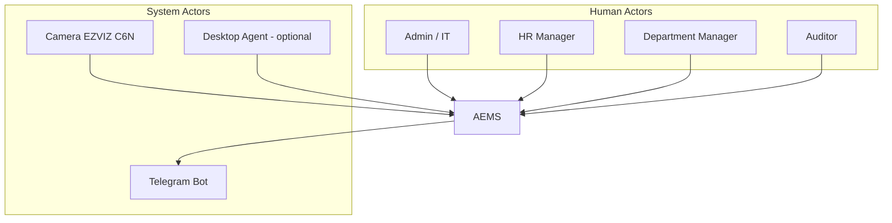
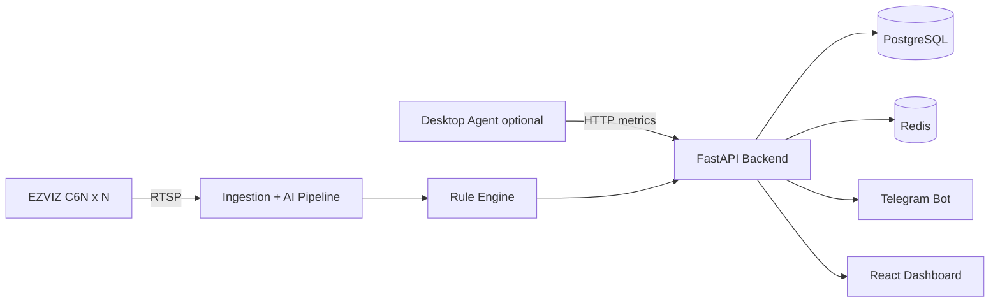
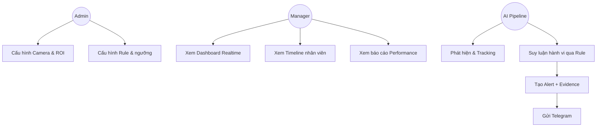

# 01 — Software Requirement Specification (SRS)

**Dự án:** AI Employee Monitoring System (AEMS)
**Phiên bản:** 1.0 (Design)
**Chuẩn tham chiếu:** IEEE 830 / ISO/IEC 25010

---

## 1. Giới thiệu

### 1.1 Mục đích
Tài liệu SRS mô tả đầy đủ yêu cầu chức năng và phi chức năng của hệ thống AEMS — nền tảng giám sát nhân viên văn phòng qua camera IP, sử dụng Computer Vision kết hợp Rule Engine để suy luận hành vi và tính điểm hiệu suất, gửi cảnh báo qua Telegram và hiển thị trên Dashboard.

### 1.2 Phạm vi
- **Trong phạm vi:** thu nhận RTSP đa camera, phát hiện người/vật thể, tracking, pose, phân tích ROI/motion/temporal, rule engine 7 hành vi, alert, snapshot/video evidence, performance score, dashboard, báo cáo, quản trị.
- **Ngoài phạm vi (v1):** nhận dạng khuôn mặt định danh (face recognition) — chỉ để tùy chọn mở rộng; phân tích âm thanh; chấm công sinh trắc học.

### 1.3 Định nghĩa & thuật ngữ

| Thuật ngữ | Ý nghĩa |
|-----------|---------|
| ROI | Region of Interest — vùng quan tâm (bàn làm việc, khu vực) |
| Track ID | Định danh tạm thời gán cho một người trong quá trình tracking |
| Temporal Analysis | Phân tích theo thời gian (cửa sổ trượt, debounce, hysteresis) |
| FP / FN | False Positive / False Negative |
| Debounce | Yêu cầu điều kiện duy trì đủ lâu mới kích hoạt |
| Hysteresis | Ngưỡng bật/tắt khác nhau để tránh dao động (flapping) |
| Evidence | Bằng chứng: snapshot ảnh + đoạn video clip |
| Agent | Phần mềm chạy trên máy nhân viên thu keyboard/mouse activity (tùy chọn) |

### 1.4 Đối tượng người dùng (Actors)

| Actor | Vai trò | Quyền chính |
|-------|---------|-------------|
| Admin/IT | Quản trị hệ thống | Cấu hình camera, ROI, rule, user, xem tất cả |
| HR Manager | Nhân sự | Xem báo cáo, performance, alert; không sửa cấu hình AI |
| Department Manager | Quản lý phòng ban | Xem dữ liệu phòng ban của mình |
| Auditor | Kiểm toán | Chỉ đọc log & evidence (read-only) |

---

## 2. Mô tả tổng thể

### 2.1 Bối cảnh sản phẩm

### 2.2 Ràng buộc kỹ thuật
- Camera EZVIZ C6N (CS-C6N-R101-1G2WF): độ phân giải tối đa ~1080p, codec H.264/H.265, có RTSP.
- Server: Windows 11 + GPU NVIDIA RTX. Triển khai container qua Docker Desktop + WSL2 + NVIDIA Container Toolkit.
- Ngôn ngữ: Python 3.12; AI: PyTorch/Ultralytics; Backend: FastAPI.

### 2.3 Giả định & phụ thuộc
- Băng thông LAN đủ cho N stream 1080p.
- Ánh sáng văn phòng ổn định (yêu cầu tối thiểu cho CV).
- Doanh nghiệp đã có **cơ sở pháp lý & thông báo giám sát** cho nhân viên (xem [14-Security-Analysis](./14-Security-Analysis.md)).

---

## 3. Yêu cầu chức năng (Functional Requirements)

Ký hiệu: **FR-<nhóm>-<số>**. Ưu tiên: M=Must, S=Should, C=Could.

### 3.1 Quản lý Camera & Ingestion

| ID | Yêu cầu | Ưu tiên |
|----|---------|---------|
| FR-CAM-01 | Thêm/sửa/xóa camera với URL RTSP, credential, độ phân giải, FPS | M |
| FR-CAM-02 | Kết nối nhiều camera đồng thời, mỗi camera một pipeline độc lập | M |
| FR-CAM-03 | Tự động reconnect khi mất stream (backoff) | M |
| FR-CAM-04 | Giám sát tình trạng camera (online/offline/lag) | M |
| FR-CAM-05 | Cấu hình sub-stream để giảm tải AI (analytics) và main-stream để lưu evidence | S |

### 3.2 AI Detection & Tracking

| ID | Yêu cầu | Ưu tiên |
|----|---------|---------|
| FR-AI-01 | Phát hiện `person` bằng YOLO | M |
| FR-AI-02 | Phát hiện object: `phone`, `cup`, `bottle`, `food` | M |
| FR-AI-03 | Tracking person bằng ByteTrack, giữ Track ID ổn định | M |
| FR-AI-04 | Pose estimation: head, arms, body, hands (keypoints) | M |
| FR-AI-05 | Kiến trúc cho phép thêm class object mới không đổi core | S |
| FR-AI-06 | Face detection (không phải recognition) — tùy chọn | C |

### 3.3 Phân tích không gian & thời gian

| ID | Yêu cầu | Ưu tiên |
|----|---------|---------|
| FR-AN-01 | Định nghĩa ROI đa giác cho từng bàn/khu vực trên mỗi camera | M |
| FR-AN-02 | Xác định person thuộc ROI nào (điểm chân/centroid) | M |
| FR-AN-03 | Motion analysis: mức độ chuyển động theo track theo thời gian | M |
| FR-AN-04 | Tính khoảng cách giữa các person (chuẩn hóa theo scale) | M |
| FR-AN-05 | Ước lượng hướng mặt (facing) từ pose để xét "quay vào nhau" | S |
| FR-AN-06 | Sliding window lưu trạng thái N giây gần nhất cho mỗi track | M |

### 3.4 Rule Engine (7 hành vi)

| ID | Hành vi | Ưu tiên |
|----|---------|---------|
| FR-RE-01 | Dùng điện thoại | M |
| FR-RE-02 | Rời vị trí (ra khỏi ROI) | M |
| FR-RE-03 | Nói chuyện riêng | S |
| FR-RE-04 | Ngồi không làm việc (idle) | S |
| FR-RE-05 | Ăn uống | S |
| FR-RE-06 | Ngủ gật | S |
| FR-RE-07 | Tụ tập (>=3 người) | S |
| FR-RE-08 | Ngưỡng của tất cả rule cấu hình được (YAML/DB), hot-reload | M |
| FR-RE-09 | Mỗi rule có debounce + hysteresis chống FP | M |
| FR-RE-10 | Bật/tắt rule theo camera/ROI/khung giờ | S |

### 3.5 Alert & Evidence

| ID | Yêu cầu | Ưu tiên |
|----|---------|---------|
| FR-AL-01 | Tạo alert khi rule kích hoạt, kèm confidence & metadata | M |
| FR-AL-02 | Chụp snapshot tại thời điểm vi phạm (có bounding box) | M |
| FR-AL-03 | Lưu video evidence (pre/post-roll ~10s) qua ring buffer | M |
| FR-AL-04 | Gửi Telegram: ảnh, video, camera, employee/track, confidence, rule, time, ROI | M |
| FR-AL-05 | Chống spam alert (cooldown theo track+rule) | M |
| FR-AL-06 | Xác nhận/đóng/đánh dấu false-positive alert (workflow) | S |

### 3.6 Performance Score & Báo cáo

| ID | Yêu cầu | Ưu tiên |
|----|---------|---------|
| FR-PF-01 | Tổng hợp thời lượng: working, phone, talking, away, idle, eating | M |
| FR-PF-02 | Tính Performance Score (0–100) theo công thức cấu hình được | M |
| FR-PF-03 | Báo cáo theo ngày/tuần/tháng, theo cá nhân/phòng ban | M |
| FR-PF-04 | Xuất CSV/PDF | S |
| FR-PF-05 | Heatmap hoạt động theo khu vực & thời gian | S |

### 3.7 Dashboard & Định danh

| ID | Yêu cầu | Ưu tiên |
|----|---------|---------|
| FR-UI-01 | Xem live camera + overlay detection/tracking/ROI | M |
| FR-UI-02 | Danh sách alert realtime + filter | M |
| FR-UI-03 | Timeline từng nhân viên/track theo ngày | M |
| FR-UI-04 | Replay evidence video | M |
| FR-UI-05 | Thống kê & biểu đồ (charts) | M |
| FR-UI-06 | Gán Track ID ↔ Employee (thủ công hoặc theo bàn/ROI) | S |
| FR-UI-07 | Quản lý user, role, camera, ROI, rule qua UI | M |

### 3.8 Quản trị & Hệ thống

| ID | Yêu cầu | Ưu tiên |
|----|---------|---------|
| FR-SYS-01 | Xác thực JWT + RBAC | M |
| FR-SYS-02 | Audit log mọi hành động quản trị | M |
| FR-SYS-03 | Health check & metrics (Prometheus) | S |
| FR-SYS-04 | Retention policy tự xóa evidence quá hạn | M |
| FR-SYS-05 | Desktop Agent gửi keyboard/mouse activity (tùy chọn) | C |

---

## 4. Yêu cầu phi chức năng (Non-Functional — ISO 25010)

| ID | Thuộc tính | Yêu cầu đo lường |
|----|-----------|------------------|
| NFR-PERF-01 | Hiệu năng | ≥ 12–15 FPS phân tích/ camera trên 1 GPU RTX với ≤ 8 camera (detection ở sub-stream) |
| NFR-PERF-02 | Độ trễ | Từ sự kiện thực → alert Telegram ≤ 5 giây (không tính thời lượng debounce của rule) |
| NFR-SCAL-01 | Khả năng mở rộng | Scale ngang bằng cách thêm worker/GPU; kiến trúc queue-based |
| NFR-AVAIL-01 | Sẵn sàng | Uptime ≥ 99% giờ làm việc; auto-recover pipeline lỗi |
| NFR-REL-01 | Độ tin cậy | Mất 1 camera không ảnh hưởng camera khác (bulkhead) |
| NFR-ACC-01 | Độ chính xác | Precision alert ≥ 90% (mục tiêu sau tuning); FP rate thấp nhờ rule+temporal |
| NFR-SEC-01 | Bảo mật | TLS, mã hóa credential, RBAC, audit — xem tài liệu 14 |
| NFR-PRIV-01 | Riêng tư | Che vùng ngoài ROI làm việc (masking) nếu cần; retention tối thiểu |
| NFR-MAINT-01 | Bảo trì | Cấu hình tách khỏi code; log có cấu trúc; test coverage ≥ 70% core |
| NFR-USE-01 | Khả dụng | Dashboard phản hồi < 300ms cho thao tác thường; i18n VI/EN |
| NFR-PORT-01 | Khả chuyển | Chạy được qua Docker; tách GPU worker khỏi API |

---

## 5. Use Cases chính

### UC-07: Suy luận hành vi "Dùng điện thoại" (mô tả chi tiết)

| Mục | Nội dung |
|-----|----------|
| Actor | AI Pipeline + Rule Engine |
| Tiền điều kiện | Camera online, model đã load, ROI đã cấu hình |
| Luồng chính | 1) YOLO phát hiện `person` và `phone`; 2) Tracking gán Track ID; 3) Pose xác định tay/đầu; 4) Kiểm tra phone gần person + vị trí tay-đầu; 5) Debounce > 10s; 6) Tạo alert + evidence; 7) Gửi Telegram |
| Luồng phụ | Nếu phone che khuất < ngưỡng thời gian → không alert (reset window) |
| Hậu điều kiện | Alert lưu DB, evidence lưu storage, cooldown kích hoạt |

---

## 6. Ma trận truy vết yêu cầu (Traceability — trích)

| FR | TDD | Rule Engine | DB | API | Test |
|----|-----|-------------|----|----|------|
| FR-AI-01 | §AI Pipeline | — | detections | /detections | TC-AI-01 |
| FR-RE-01 | §Rule | Behavior-1 | alerts, rules | /alerts | TC-RE-01 |
| FR-AL-04 | §Notify | — | notifications | /notify | TC-AL-04 |
| FR-PF-02 | §Scoring | — | performance | /performance | TC-PF-02 |

---

## 7. Tiêu chí nghiệm thu (Acceptance)
- Tất cả FR-*-M được triển khai và pass test tương ứng.
- Đạt NFR-PERF-01/02 trên môi trường staging với ≥ 4 camera.
- FP rate của mỗi rule ≤ ngưỡng thỏa thuận sau tuning (ví dụ ≤ 10%).
- Có tài liệu vận hành & tuân thủ pháp lý bàn giao.

---

## 8. Best Practices
- Viết yêu cầu **đo lường được** (SMART), tránh mô tả mơ hồ.
- Tách **ngưỡng rule** ra cấu hình để tinh chỉnh không cần đổi code.
- Ưu tiên **giảm FP** hơn tối đa recall — báo động sai gây mất niềm tin & rủi ro pháp lý.
- Thiết kế **privacy-by-design** ngay từ SRS.

## 9. Risk (tóm tắt, chi tiết ở tài liệu 13)
- Sai lệch domain (ánh sáng/góc camera) → giảm accuracy.
- Rủi ro pháp lý về giám sát nhân viên.
- Quá tải GPU khi tăng số camera.

## 10. Performance (tóm tắt, chi tiết ở tài liệu 15)
- Dùng sub-stream cho AI, main-stream cho evidence.
- Batch inference + TensorRT + frame skipping thích ứng.
