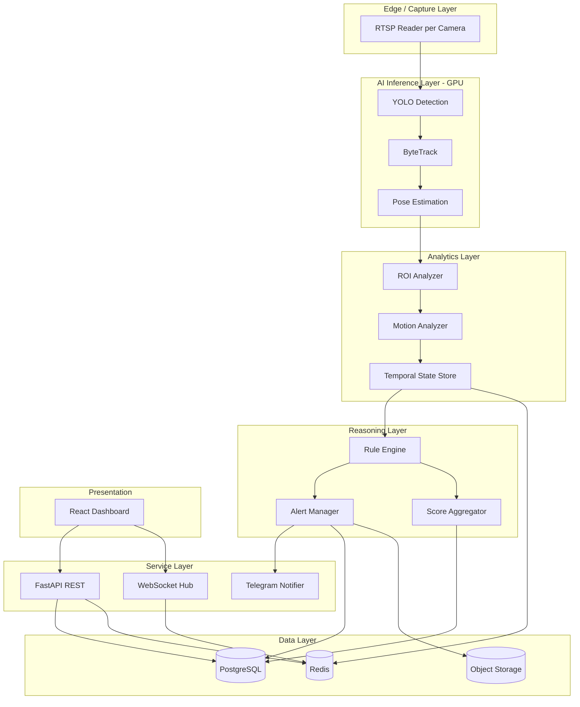
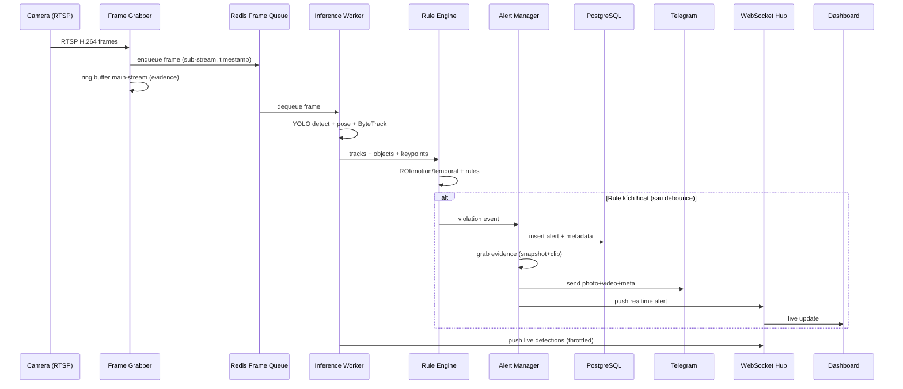
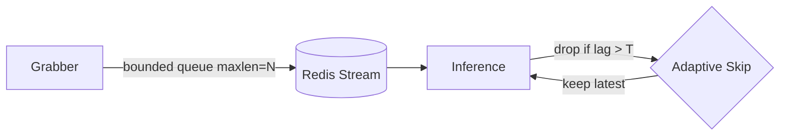

# 02 — Technical Design Document (TDD)

**Dự án:** AI Employee Monitoring System (AEMS)
**Phiên bản:** 1.0

---

## 1. Mục tiêu thiết kế
Chuyển hóa yêu cầu SRS thành thiết kế kỹ thuật khả thi: mô-đun hóa, tách biệt AI khỏi Backend, dùng hàng đợi (queue) để tách nhịp (decouple) real-time, đảm bảo khả năng mở rộng và độ bền lỗi (fault tolerance).

### 1.1 Nguyên tắc kiến trúc
- **Separation of Concerns:** Ingestion / Inference / Rule / API / UI tách biệt.
- **Loose Coupling via Queue:** Redis Streams làm message bus giữa AI worker và backend.
- **Stateless API, Stateful Workers:** API scale ngang; worker giữ state theo camera.
- **Config over Code:** ngưỡng, rule, ROI nằm ở YAML/DB.
- **Bulkhead & Backpressure:** một camera lỗi không kéo sập hệ thống; drop frame khi quá tải.
- **Idempotency:** alert có key duy nhất (track+rule+cửa sổ) để chống trùng.

---

## 2. Kiến trúc tầng (Layered)



---

## 3. Thành phần chính (Components)

| Component | Trách nhiệm | Công nghệ | Scale |
|-----------|-------------|-----------|-------|
| Frame Grabber | Đọc RTSP, decode, đẩy frame vào queue | OpenCV/FFmpeg, asyncio | 1 process / N camera |
| Inference Worker | YOLO detect + pose, ByteTrack | PyTorch, Ultralytics, TensorRT | 1+ / GPU |
| Analytics Engine | ROI, motion, distance, facing, sliding window | NumPy, Shapely | in-worker |
| Rule Engine | Áp luật, debounce, hysteresis | Python thuần + YAML | in-worker/service |
| Alert Manager | Dedup, cooldown, evidence, persist | Python, SQLAlchemy | service |
| Evidence Recorder | Ring buffer video + snapshot | OpenCV/FFmpeg | in-grabber |
| API Server | REST + WS, auth, CRUD | FastAPI | N replicas |
| Notifier | Telegram gửi ảnh/video | httpx | worker |
| Scheduler | Score rollup, retention, report | APScheduler/Celery | 1 |
| Frontend | Dashboard | React+Vite | static/Nginx |

---

## 4. Luồng dữ liệu chi tiết (Sequence)



---

## 5. Mô hình dữ liệu luồng (Message Contracts)

### 5.1 FrameMessage (Grabber → Inference)
```json
{
  "camera_id": "cam-01",
  "frame_id": 128374,
  "ts": 1751350000.123,
  "shape": [1080, 1920, 3],
  "ref": "shm://cam-01/128374"
}
```

### 5.2 InferenceResult (Inference → Rule)
```json
{
  "camera_id": "cam-01",
  "frame_id": 128374,
  "ts": 1751350000.150,
  "tracks": [
    {
      "track_id": 42,
      "cls": "person",
      "bbox": [x1,y1,x2,y2],
      "conf": 0.93,
      "keypoints": [[x,y,score], "... 17 COCO points"],
      "roi_id": "desk-07"
    }
  ],
  "objects": [
    {"cls": "phone", "bbox": [x1,y1,x2,y2], "conf": 0.81}
  ]
}
```

### 5.3 ViolationEvent (Rule → Alert)
```json
{
  "rule_id": "phone_usage",
  "camera_id": "cam-01",
  "track_id": 42,
  "roi_id": "desk-07",
  "confidence": 0.88,
  "started_at": 1751349980.0,
  "duration_s": 12.4,
  "evidence_window": [1751349975.0, 1751349992.0]
}
```

---

## 6. Xử lý bất đồng bộ & Backpressure



- **Bounded queue**: khi đầy → drop frame cũ (giữ latest → ưu tiên realtime).
- **Adaptive frame skipping**: nếu độ trễ inference tăng, tăng bước bỏ frame.
- **Per-camera isolation**: mỗi camera có queue & worker slot riêng (bulkhead).

---

## 7. Quản lý State thời gian (Temporal)

| State | Lưu ở đâu | TTL | Mục đích |
|-------|-----------|-----|----------|
| Track window (bbox, pose, roi) | Redis / in-memory ring | 60–120s | Rule temporal |
| Rule timers (start_ts per track+rule) | in-memory + Redis backup | tới khi reset | Debounce |
| Cooldown map | Redis | vài phút | Chống spam alert |
| Motion history | in-memory | window | Idle/sleep detection |

**Debounce + Hysteresis:** rule bật khi điều kiện đúng liên tục ≥ `on_seconds`, tắt khi sai liên tục ≥ `off_seconds` (`off < on`) để tránh flapping.

---

## 8. Xử lý lỗi & phục hồi

| Lỗi | Chiến lược |
|-----|-----------|
| Mất RTSP | Exponential backoff reconnect, đánh dấu camera offline, alert hệ thống |
| GPU OOM | Giảm batch, giảm độ phân giải, fallback CPU (giới hạn) |
| Redis down | Buffer local tạm; degrade sang chỉ-alert-critical |
| DB down | Ghi WAL local (file) → replay khi phục hồi |
| Telegram lỗi | Retry queue với backoff; lưu pending notification |

---

## 9. Cấu hình (Config Schema — trích YAML)
```yaml
system:
  gpu_id: 0
  max_cameras_per_worker: 4
detection:
  model: yolo11m.pt
  conf: 0.35
  iou: 0.5
  classes: [person, cell phone, cup, bottle]
pose:
  model: yolo11m-pose.pt
tracking:
  type: bytetrack
  track_thresh: 0.5
  match_thresh: 0.8
rules:
  phone_usage:
    enabled: true
    on_seconds: 10
    off_seconds: 3
    cooldown_seconds: 120
```

---

## 10. Công nghệ & phiên bản (Bill of Technology)

| Hạng mục | Lựa chọn | Lý do |
|----------|----------|-------|
| YOLO | Ultralytics YOLO11 (detect + pose) | SOTA, dễ export TensorRT |
| Tracking | ByteTrack | Bám tốt khi occlusion, nhẹ |
| Serialization | msgpack/JSON | Nhanh, gọn |
| Message bus | Redis Streams | Đơn giản, consumer group |
| ORM | SQLAlchemy 2.0 async | Async, mature |
| Migration | Alembic | Chuẩn |
| Task | APScheduler (v1), Celery (scale) | Rollup, retention |

---

## 11. Best Practices
- Zero-copy frame qua shared memory khi cùng host, tránh serialize ảnh lớn.
- Tách **model warmup** khỏi luồng phục vụ (load & warmup lúc khởi động).
- Structured logging (JSON) + correlation id theo frame/track.
- Feature flags cho từng rule.

## 12. Risk (tóm tắt)
- Coupling ngầm qua Redis schema → dùng versioned message contract.
- Memory leak ở ring buffer video → giới hạn dung lượng & giám sát.

## 13. Performance (tóm tắt)
- Mục tiêu: pipeline < 70ms/frame ở 1080p sub-stream với YOLO11m + TensorRT FP16.
- Chi tiết benchmark ở [15-Performance-Analysis](./15-Performance-Analysis.md).
