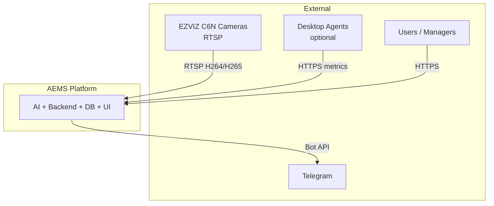
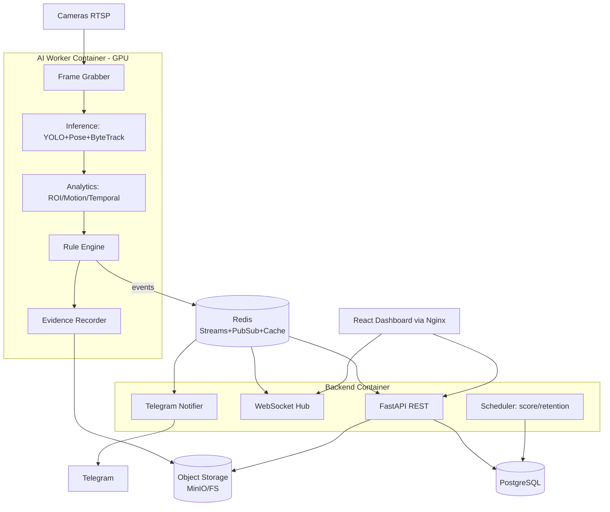
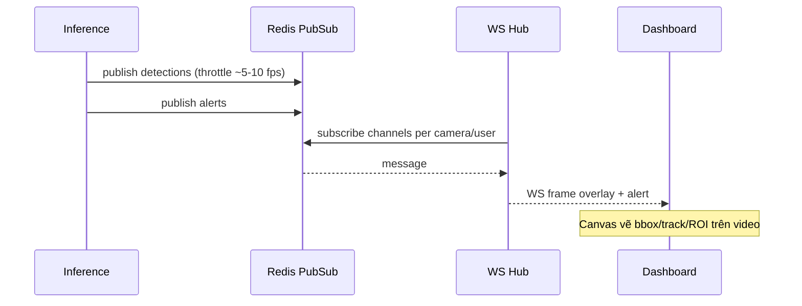
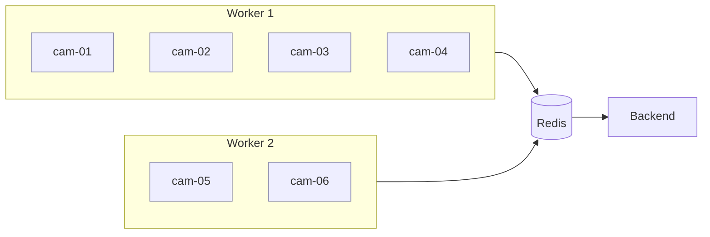
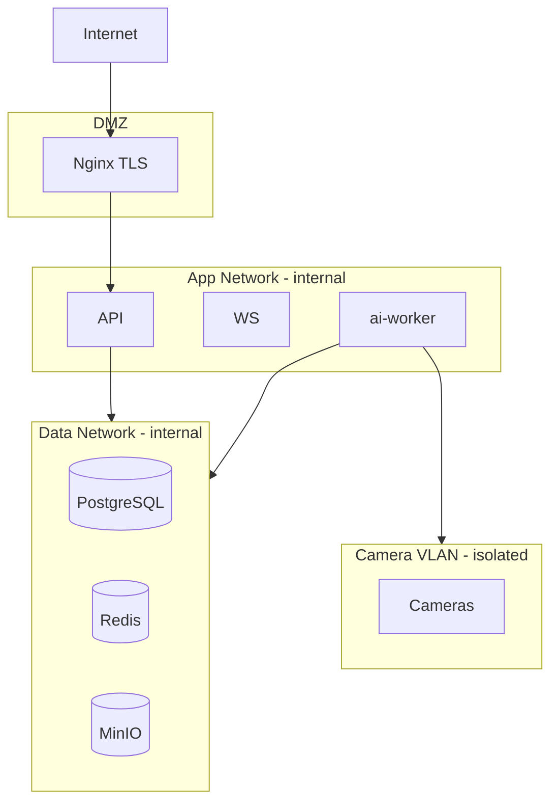

# 03 — System Architecture

**Dự án:** AI Employee Monitoring System (AEMS)

---

## 1. Kiến trúc tổng thể (C4 — Context)

---

## 2. Container Diagram (C4 — Level 2)

---

## 3. Phân rã tiến trình (Deployment view logic)

| Tiến trình | Số lượng | Tài nguyên | Ghi chú |
|-----------|----------|-----------|---------|
| ai-worker | ceil(N_cam / 4) | GPU chia sẻ, RAM cao | Mỗi worker xử lý ≤ 4 camera |
| backend-api | 2 (HA) | CPU, RAM vừa | Stateless, sau Nginx |
| ws-hub | gộp trong backend hoặc riêng | CPU | Pub/Sub Redis |
| scheduler | 1 | CPU | Cron rollup/retention |
| postgres | 1 (+replica tùy) | Disk nhanh | TimescaleDB tùy chọn |
| redis | 1 | RAM | Persistence AOF |
| minio | 1 | Disk lớn | Evidence |
| nginx | 1 | — | Reverse proxy + TLS |

---

## 4. Luồng realtime tới Dashboard

Chiến lược hiển thị video:
- **Live view**: dùng HLS/WebRTC từ camera hoặc MJPEG proxy nhẹ; overlay vẽ client-side từ dữ liệu WS (đồng bộ theo timestamp).
- **Replay**: phát video evidence từ Object Storage qua signed URL.

---

## 5. Mô hình đa camera (Scaling)

- Gán camera → worker qua **config/registry** trong DB.
- Cân bằng tải theo độ phức tạp cảnh (số người trung bình).
- Thêm GPU → thêm worker → cập nhật registry.

---

## 6. Ranh giới tin cậy & mạng (Trust boundaries)

- Camera đặt ở **VLAN riêng**, chỉ worker truy cập được (không ra Internet).
- DB/Redis/MinIO ở network nội bộ, không expose ra ngoài.
- Chỉ Nginx expose 443.

---

## 7. Quyết định kiến trúc (ADR — tóm tắt)

| ADR | Quyết định | Lý do | Đánh đổi |
|-----|-----------|-------|----------|
| ADR-01 | Redis Streams làm bus | Đơn giản, đã có Redis | Không bền bằng Kafka |
| ADR-02 | AI worker tách khỏi API | Cô lập GPU, scale riêng | Thêm phức tạp deploy |
| ADR-03 | Rule Engine chạy trong worker | Giảm độ trễ, gần dữ liệu | Khó scale rule độc lập |
| ADR-04 | Sub-stream cho AI | Tiết kiệm GPU/băng thông | Độ phân giải thấp hơn |
| ADR-05 | Overlay vẽ client-side | Giảm tải server encode | Cần đồng bộ timestamp |

---

## 8. Best Practices
- **12-Factor**: config qua env, log ra stdout, process stateless nơi có thể.
- **Health/readiness** endpoint cho mọi container.
- **Graceful shutdown**: flush queue, đóng stream đúng cách.
- **Observability**: metrics FPS, queue depth, GPU util, alert rate.

## 9. Risk (tóm tắt)
- Redis là single point → cân nhắc Redis Sentinel/persistence.
- Băng thông camera VLAN → dùng sub-stream, giám sát.

## 10. Performance (tóm tắt)
- Throttle WS, batch inference, zero-copy frame (shared memory) — chi tiết ở tài liệu 15.
