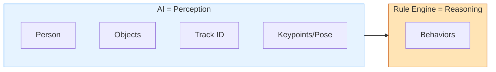
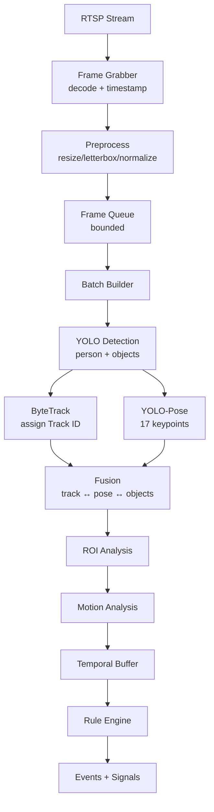
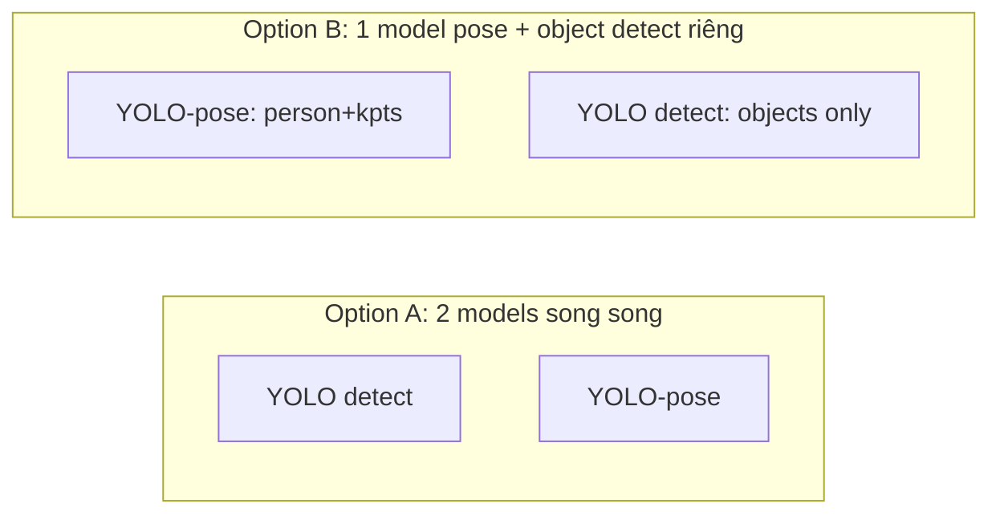
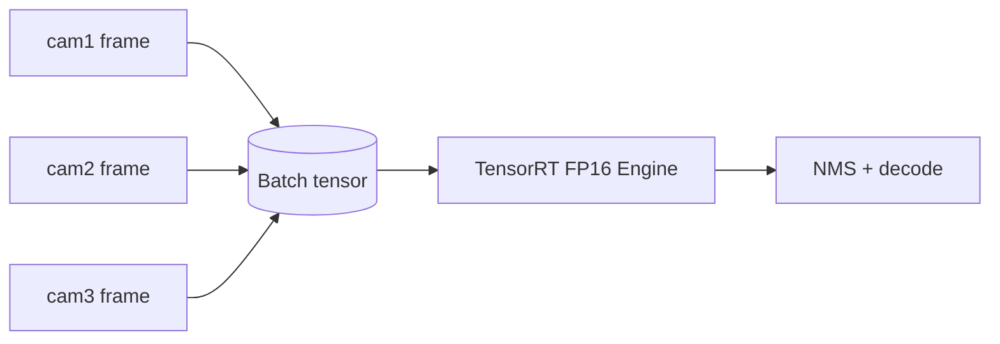
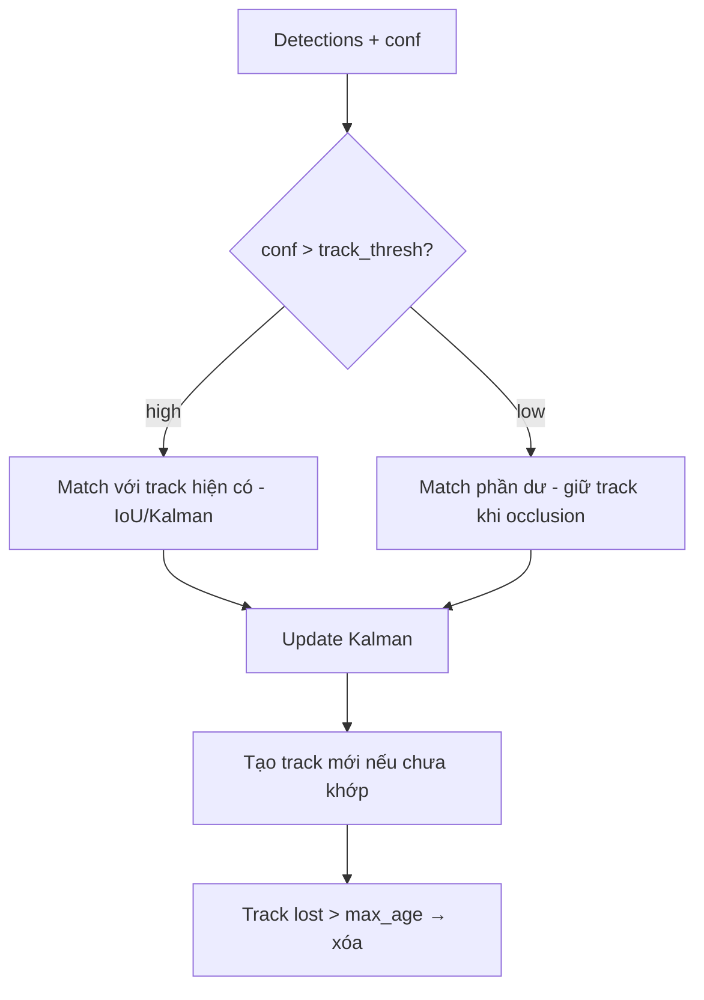
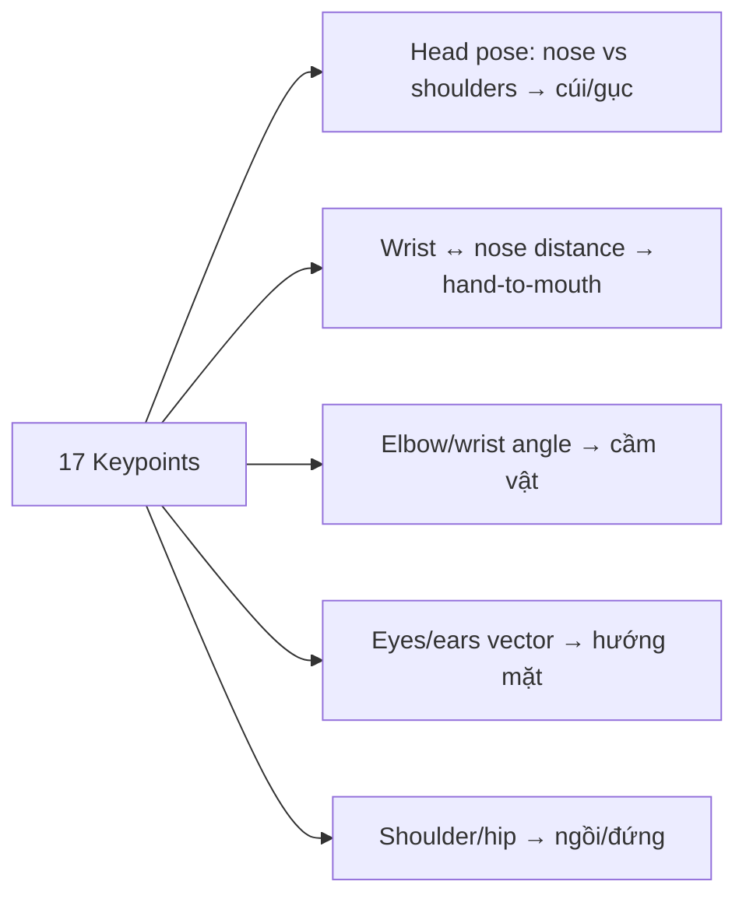
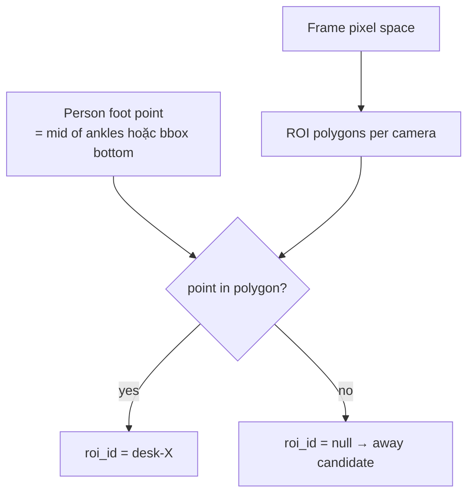
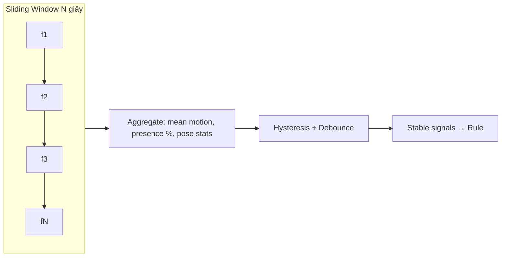
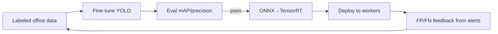

# 04 — AI Architecture

**Dự án:** AI Employee Monitoring System (AEMS)

---

## 1. Triết lý AI

AI **chỉ tạo ra tín hiệu khách quan**, không kết luận hành vi. Kết luận thuộc về Rule Engine (tài liệu 05).

---

## 2. AI Pipeline đầy đủ

---

## 3. Model Zoo & lựa chọn

| Chức năng | Model đề xuất | Input | Output | Ghi chú |
|-----------|---------------|-------|--------|---------|
| Detection (person+object) | YOLO11m | 640/960 | bbox, cls, conf | COCO có sẵn: person, cell phone, cup, bottle |
| Pose | YOLO11m-pose | 640 | 17 COCO keypoints | Head, arms, hands, body |
| Tracking | ByteTrack | detections | track_id | Không cần GPU thêm |
| Food detection | Fine-tune YOLO (custom) | 640 | food bbox | COCO không có "food" chung → cần dataset custom |
| Face detection (optional) | YOLOv8-face / SCRFD | 640 | face bbox | Chỉ detect, không recognize (v1) |

> **Lưu ý class mapping COCO:** `phone` = `cell phone` (id 67), `cup` (41), `bottle` (39). `food` không có class đơn lẻ trong COCO → dùng nhóm (banana/apple/sandwich/pizza/donut/cake...) hoặc train custom "food".

---

## 4. Chiến lược inference

### 4.1 Kết hợp Detection + Pose
Hai phương án:

| | Option A | Option B |
|-|----------|----------|
| Ưu | Detect object chính xác, pose đầy đủ | Ít trùng lặp person |
| Nhược | 2 lần suy luận | pose model detect object kém |
| Khuyến nghị | **Option B**: pose-model lo person+keypoints, detect-model lo object (phone/cup/bottle/food), rồi fuse. | |

### 4.2 Batch & tối ưu

- **TensorRT FP16** (hoặc INT8 sau calibrate) tăng throughput 2–4×.
- **Batching đa camera** cùng worker để bão hòa GPU.
- **CUDA streams** cho decode + inference song song.
- **Warmup** khi khởi động để tránh spike độ trễ đầu.

---

## 5. Tracking (ByteTrack) chi tiết

| Tham số | Giá trị mặc định | Ý nghĩa |
|---------|------------------|---------|
| track_thresh | 0.5 | Ngưỡng detection high-conf |
| match_thresh | 0.8 | Ngưỡng IoU match |
| track_buffer | 30 frames | Giữ track khi mất tạm |
| min_box_area | 100 px | Bỏ box quá nhỏ |

**Ổn định Track ID** rất quan trọng cho temporal rule → tune buffer theo FPS và mức occlusion.

---

## 6. Pose → Feature cho Rule Engine

COCO 17 keypoints: nose, eyes, ears, shoulders, elbows, wrists, hips, knees, ankles.

| Feature | Cách tính | Dùng cho hành vi |
|---------|-----------|------------------|
| head_down_ratio | (nose.y - shoulder_mid.y) / torso_len | Ngủ gật, cúi |
| hand_to_mouth | dist(wrist, nose) < k·head_size | Ăn uống, dùng phone |
| facing_vector | từ ear→eye→nose | Nói chuyện (quay vào nhau) |
| wrist_near_object | dist(wrist, object_bbox) | Cầm phone/cup |
| torso_motion | biến thiên keypoint theo window | Idle/sleep |

---

## 7. ROI & Homography

- ROI vẽ trên UI, lưu polygon (list điểm normalized 0–1) → độc lập độ phân giải.
- Điểm đại diện người: **điểm chân** (ổn định hơn centroid khi che khuất).
- **Scale normalization**: dùng chiều cao bbox/khoảng vai để chuẩn hóa khoảng cách (mét ~ pixel) cho rule "khoảng cách gần".

---

## 8. Motion & Temporal Analysis

- **Motion metric**: tổng dịch chuyển keypoint/bbox chuẩn hóa, hoặc optical-flow trong ROI của track.
- **Temporal buffer** lưu 60–120s/track (ring buffer) → rule truy vấn.
- Khử nhiễu: median filter trên tín hiệu boolean trước khi vào debounce.

---

## 9. Quản lý & phiên bản model (MLOps)

| Hạng mục | Cách làm |
|----------|----------|
| Model registry | Lưu weight + hash + version trong DB/MinIO |
| Reproducibility | Pin version Ultralytics/PyTorch/CUDA |
| Evaluation | Bộ test gán nhãn nội bộ (office scenes) đo mAP/precision |
| Drift monitoring | Theo dõi conf trung bình, tỉ lệ detect theo thời gian |
| Retrain loop | Thu thập FP/FN từ alert bị đánh dấu sai → dataset cải thiện |
| Export | .pt → ONNX → TensorRT engine per-GPU |

---

## 10. Bảng ngân sách độ trễ (Latency budget /frame @1080p sub)

| Bước | Mục tiêu (ms) |
|------|---------------|
| Decode + preprocess | 5–10 |
| Detection (TensorRT FP16) | 15–25 |
| Pose | 15–25 |
| ByteTrack | 2–5 |
| Analytics (ROI/motion) | 3–8 |
| Rule Engine | 1–3 |
| **Tổng** | **~45–75 ms → ~13–22 FPS** |

---

## 11. Best Practices
- Không chạy AI trên main-stream 1080p full FPS — dùng sub-stream + frame skip.
- Chuẩn hóa toạ độ về [0,1] để độc lập độ phân giải.
- Fuse object↔person bằng IoU + khoảng cách wrist, không chỉ IoU.
- Đặt confidence threshold **riêng theo class** (phone cần chắc chắn hơn).

## 12. Risk
- "food" và "phone cầm tay" dễ nhầm → cần dataset & tuning.
- Track ID switch khi đông người → ảnh hưởng temporal rule.

## 13. Performance
- INT8 calibration cho GPU yếu; multi-stream CUDA; pin memory. Chi tiết tài liệu 15.
