# 05 — Rule Engine Design (Thành phần quan trọng nhất)

**Dự án:** AI Employee Monitoring System (AEMS)

> Rule Engine **suy luận hành vi** từ tín hiệu AI, KHÔNG dùng AI đoán hành vi trực tiếp. Mọi kết luận đều **tường minh, kiểm chứng được, cấu hình được**.

---

## 1. Nguyên lý thiết kế

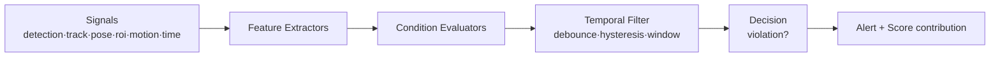

**5 lớp lọc chống False Positive:**
1. **Confidence gating** — chỉ nhận tín hiệu AI đủ chắc chắn.
2. **Spatial logic** — quan hệ không gian (gần, trong ROI, hướng mặt).
3. **Temporal debounce** — điều kiện phải kéo dài đủ lâu.
4. **Hysteresis** — ngưỡng bật/tắt khác nhau, tránh flapping.
5. **Cooldown** — không lặp alert cùng track+rule trong khoảng thời gian.

---

## 2. Kiến trúc Rule Engine

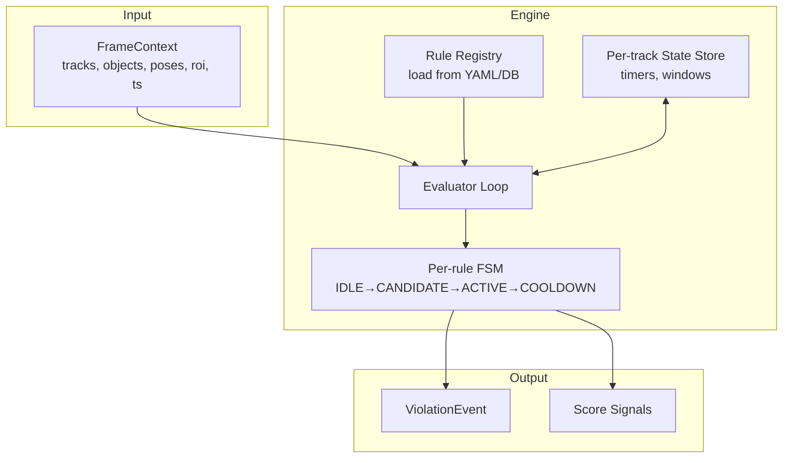

### 2.1 Máy trạng thái mỗi rule (per track+rule)

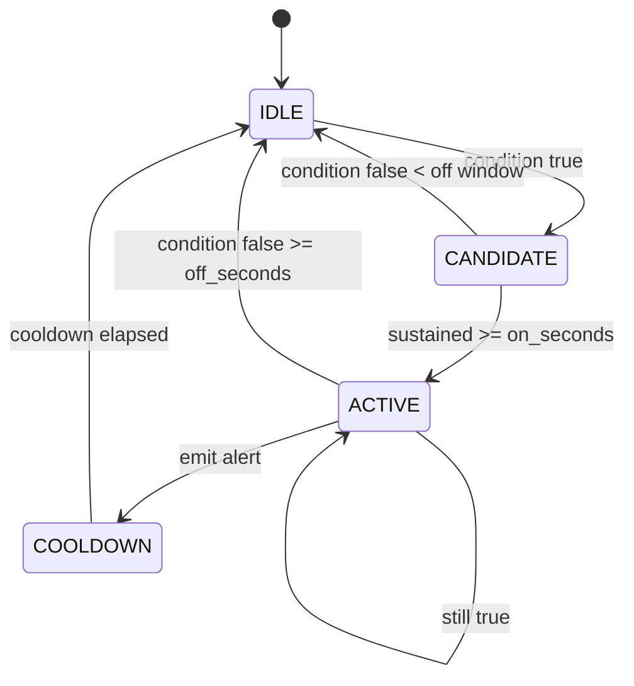

---

## 3. Mô hình luật (Rule Schema)

```yaml
rule:
  id: phone_usage
  name: "Sử dụng điện thoại"
  category: distraction
  enabled: true
  scope:
    cameras: ["*"]        # hoặc danh sách
    rois: ["*"]
    time_windows: ["08:00-12:00", "13:00-17:00"]
  params:
    conf_min_phone: 0.55
    wrist_phone_dist: 0.15   # normalized theo head_size
    on_seconds: 10
    off_seconds: 3
    cooldown_seconds: 120
  severity: medium
  score_weight: 2.0
  evidence:
    snapshot: true
    clip_pre_s: 5
    clip_post_s: 5
```

**Ưu điểm:** thêm/tắt/sửa rule không cần đổi code; hot-reload qua API.

---

## 4. Bảy hành vi — thiết kế chi tiết

### Ký hiệu chung
- `T` = track (person), `obj` = object detection, `kpt` = keypoints.
- `head_size` = khoảng cách 2 tai hoặc chiều cao đầu, dùng chuẩn hóa.
- Mọi khoảng cách normalize theo `head_size` hoặc chiều cao người để độc lập scale.

---

### 4.1 HÀNH VI 1 — Dùng điện thoại

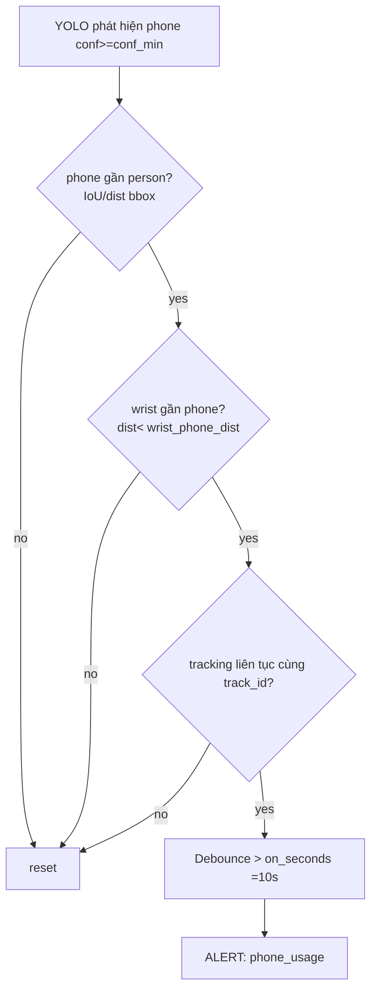

| Tín hiệu | Nguồn | Điều kiện |
|----------|-------|-----------|
| phone detected | YOLO | conf ≥ 0.55 |
| phone gần person | bbox | IoU>0 hoặc tâm phone trong vùng thân trên |
| tay cầm phone | pose | min(dist(wrist_L/R, phone)) < 0.15·norm |
| liên tục | tracking | cùng track_id, không gián đoạn > 1s |
| thời gian | temporal | ≥ 10s (debounce), off 3s |

**Chống FP:** phone trên bàn nhưng không cầm → wrist không gần → không alert. Phone lướt qua < 10s → reset.

---

### 4.2 HÀNH VI 2 — Rời vị trí (Away)

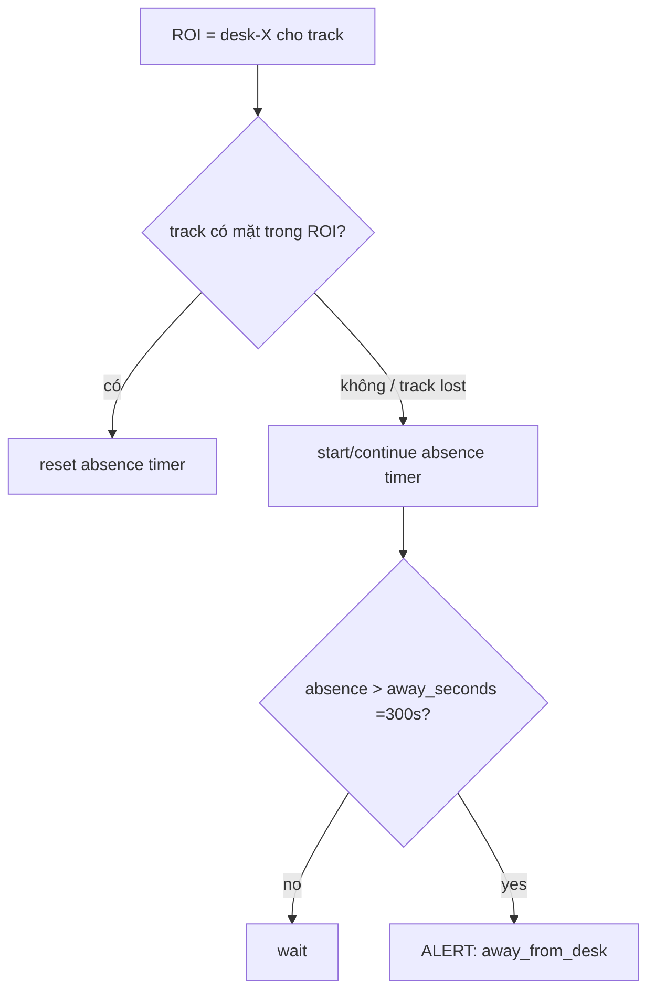

| Tham số | Mặc định | Ghi chú |
|---------|----------|---------|
| away_seconds | 300 (5 phút) | Thời gian vắng |
| grace_lost_track | 10s | Cho track switch/occlusion tạm |
| work_hours_only | true | Chỉ tính trong giờ làm |

**Chống FP:** Track ID có thể mất do occlusion → dùng **grace period** + gán ROI↔employee (nếu có) để không báo nhầm khi người vẫn ở đó nhưng đổi ID. Không tính giờ nghỉ trưa.

---

### 4.3 HÀNH VI 3 — Nói chuyện riêng

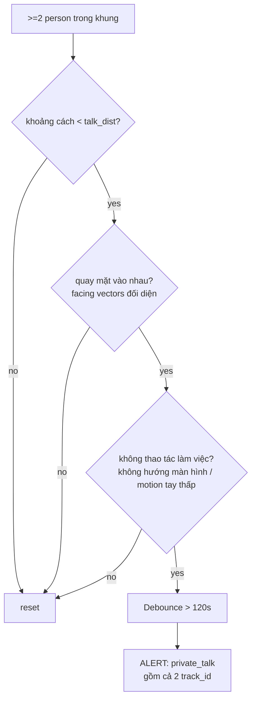

| Tín hiệu | Cách xác định |
|----------|---------------|
| số người | tracking count trong vùng lân cận |
| khoảng cách nhỏ | dist(person_i, person_j) < talk_dist (chuẩn hóa ~1.2m) |
| quay vào nhau | góc giữa 2 facing_vector đối nhau trong ngưỡng (ví dụ > 120°) |
| không làm việc | không hướng về màn hình/bàn phím, wrist motion thấp |
| thời gian | ≥ 120s |

**Chống FP:** hai người ngồi cạnh cùng làm việc (không quay vào nhau) → loại. Nói chuyện công việc ngắn < 2 phút → không alert. **Không dùng audio, không đoán nội dung.**

---

### 4.4 HÀNH VI 4 — Ngồi không làm việc (Idle)

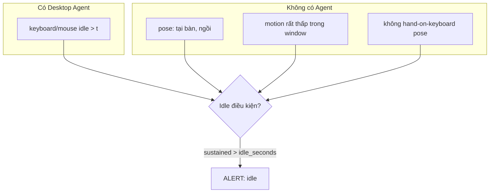

| Nguồn | Tín hiệu | Ưu tiên |
|-------|----------|---------|
| Agent (nếu có) | kb/mouse idle_time > 5 phút | **Cao** (chính xác nhất) |
| Pose/Motion | torso_motion < ε, wrist không gõ | Trung bình |
| ROI | vẫn trong ROI (khác với "away") | bắt buộc |

**Kết hợp Agent + CV:** nếu có Agent, dùng kb/mouse là chính, CV bổ trợ (đang ở bàn). Nếu không, chỉ CV với ngưỡng thời gian dài hơn để tránh FP (người đọc tài liệu vẫn là làm việc → cân nhắc, nên đặt idle_seconds lớn, ví dụ 10–15 phút).

---

### 4.5 HÀNH VI 5 — Ăn uống

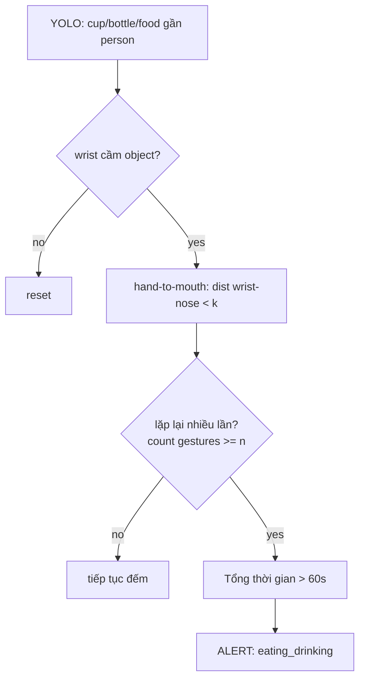

| Tín hiệu | Điều kiện |
|----------|-----------|
| object | cup/bottle/food conf ≥ 0.5 gần person |
| cầm | wrist gần object bbox |
| đưa lên miệng | dist(wrist, nose) < 0.6·head_size |
| lặp lại | ≥ 3 lần hand-to-mouth trong cửa sổ |
| thời gian | tích lũy > 60s |

**Chống FP:** cup trên bàn không cầm → loại. Uống nước 1 ngụm nhanh → dưới ngưỡng lặp/thời gian → không alert (chính sách có thể cho phép uống nước).

---

### 4.6 HÀNH VI 6 — Ngủ gật

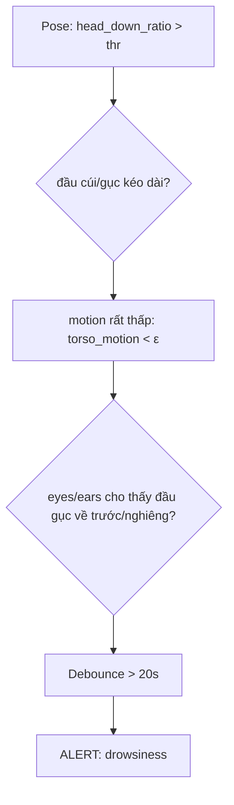

| Tín hiệu | Điều kiện |
|----------|-----------|
| đầu cúi | nose thấp hơn vai + torso gập, ratio > threshold |
| ít chuyển động | motion < ε trong toàn window |
| liên tục | ≥ 20s |

**Chống FP:** cúi đọc tài liệu/viết (có motion tay) → motion không thấp → loại. Cúi nhặt đồ ngắn → dưới 20s → loại.

---

### 4.7 HÀNH VI 7 — Tụ tập

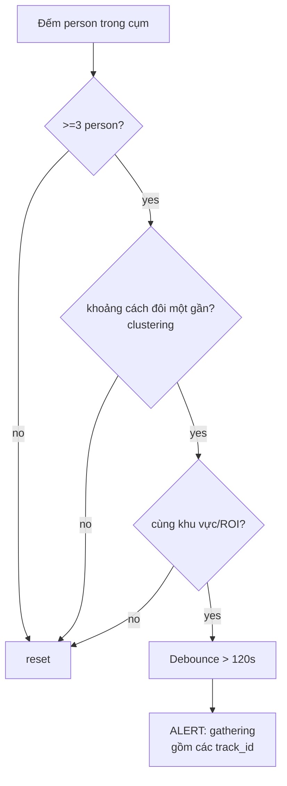

| Tín hiệu | Điều kiện |
|----------|-----------|
| số người | ≥ 3 track trong bán kính cluster |
| gần | pairwise dist < gather_dist |
| cùng ROI/vùng | cùng khu vực địa lý trong khung |
| thời gian | ≥ 120s |

**Kỹ thuật cluster:** DBSCAN trên toạ độ chân người (chuẩn hóa) với eps = gather_dist.

**Chống FP:** người đi ngang qua nhau → không đủ thời gian. Họp chính thức trong phòng họp → loại ROI phòng họp khỏi scope.

---

## 5. Bảng tổng hợp tham số 7 hành vi

| Hành vi | Tín hiệu chính | on_seconds | cooldown | severity | score_weight |
|---------|----------------|-----------|----------|----------|--------------|
| Phone usage | phone + wrist | 10 | 120 | medium | 2.0 |
| Away | ROI absence | 300 | 300 | low | 1.5 |
| Private talk | 2p + facing + gần | 120 | 300 | medium | 2.0 |
| Idle | motion/agent | 600–900 | 300 | low | 1.0 |
| Eating | cup/food + h2m | 60 | 300 | low | 1.0 |
| Drowsiness | head_down + still | 20 | 180 | high | 3.0 |
| Gathering | ≥3 + cluster | 120 | 300 | medium | 2.5 |

*(Tất cả là mặc định, chỉnh trong YAML/DB.)*

---

## 6. Performance Score

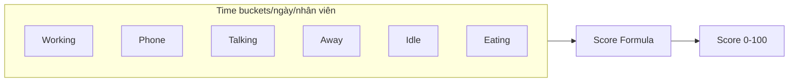

### Công thức đề xuất (cấu hình được)
```
total = working + phone + talking + away + idle + eating   (giây trong giờ làm)
penalty = w_phone·phone + w_talk·talking + w_away·away
        + w_idle·idle + w_eat·eating
score = clamp(100 · (working / total) - penalty_norm, 0, 100)
```
Trong đó `penalty_norm` chuẩn hóa theo tổng giờ làm; trọng số `w_*` cấu hình.

| Thành phần | Đóng góp | Ghi chú |
|-----------|----------|---------|
| working_time | + | thời gian hiện diện + thao tác |
| phone_time | − | trọng số cao |
| away_time | − | trừ giờ nghỉ hợp lệ |
| idle_time | − | |
| talking_time | − | chỉ "private", không phải họp |
| eating_time | − nhẹ | có thể miễn trong giờ nghỉ |

**Nguyên tắc công bằng:** score kèm **breakdown minh bạch** + cho phép quản lý review/hiệu chỉnh (không phạt tự động).

---

## 7. Hot-reload & quản trị rule

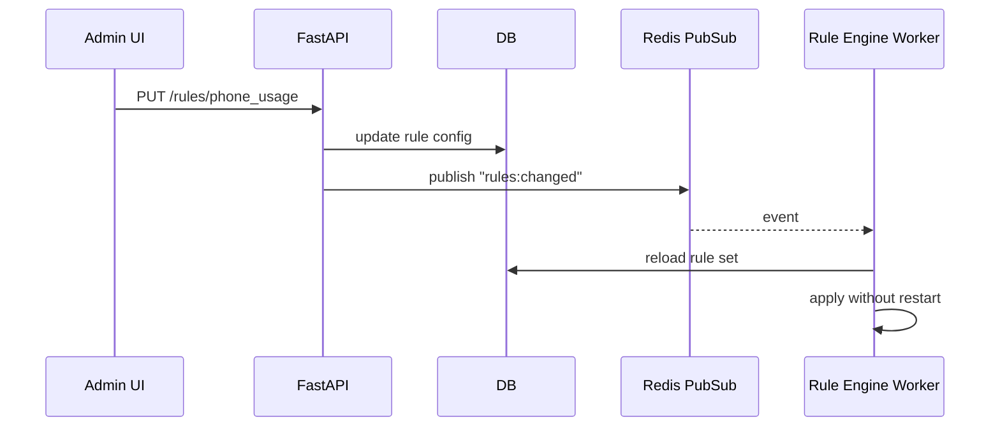

---

## 8. Kiểm thử Rule (song song tài liệu 12)
- **Golden clips**: video gán nhãn cho từng hành vi (positive & hard-negative).
- **Deterministic replay**: feed InferenceResult đã ghi lại → kiểm tra output rule ổn định.
- **Threshold sweep**: quét tham số để chọn điểm cân bằng precision/recall.

---

## 9. Best Practices
- Rule phải **thuần hàm** trên state → dễ test, dễ replay.
- Luôn kèm **evidence + lý do** (which conditions fired) trong alert để audit.
- Ưu tiên **precision**; mọi rule mới bật ở chế độ "shadow" (log, không alert) trước.
- Tách "giờ làm/giờ nghỉ" ra lịch cấu hình.

## 10. Risk
- Track ID switch phá vỡ timer → dùng grace + ROI binding.
- Tham số quá nhạy → nhiều FP → dùng shadow mode + tuning.

## 11. Performance
- Rule chạy O(tracks) mỗi frame; state trong RAM + backup Redis → < 3ms/frame.
