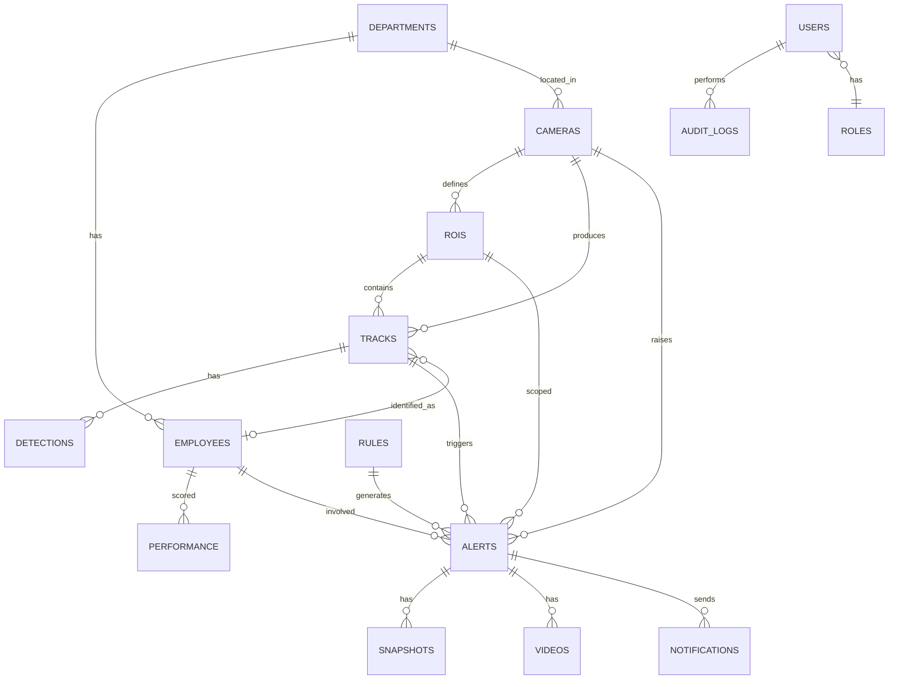
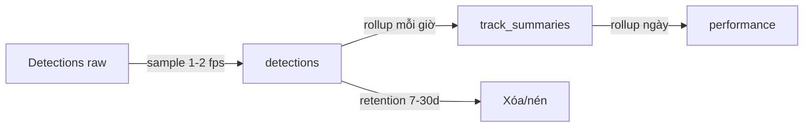

# 06 — Database Design

**DBMS:** PostgreSQL 16 (+ TimescaleDB tùy chọn cho time-series). **ORM:** SQLAlchemy 2.0 async. **Migration:** Alembic.

---

## 1. ERD tổng quan



---

## 2. Danh sách bảng

| Bảng | Mục đích | Ghi/đọc |
|------|----------|---------|
| users | Tài khoản đăng nhập | thấp |
| roles | Vai trò RBAC | thấp |
| departments | Phòng ban | thấp |
| employees | Nhân viên | thấp |
| cameras | Camera + RTSP | thấp |
| rois | Vùng quan tâm (polygon) | thấp |
| rules | Cấu hình rule | thấp |
| tracks | Phiên tracking người | **cao** |
| detections | Bản ghi detection (tùy chọn/sampled) | **rất cao** |
| alerts | Cảnh báo hành vi | trung bình |
| snapshots | Ảnh bằng chứng | trung bình |
| videos | Video bằng chứng | trung bình |
| performance | Điểm & thời lượng theo ngày | trung bình |
| notifications | Log gửi Telegram | trung bình |
| audit_logs | Nhật ký quản trị | trung bình |
| system_logs | Log hệ thống/health | cao |
| agent_metrics | kb/mouse từ Desktop Agent (tùy chọn) | cao |

---

## 3. Schema chi tiết (DDL rút gọn)

### 3.1 Định danh & tổ chức
```sql
CREATE TABLE roles (
  id           SERIAL PRIMARY KEY,
  name         VARCHAR(50) UNIQUE NOT NULL,        -- admin, hr, manager, auditor
  permissions  JSONB NOT NULL DEFAULT '[]'
);

CREATE TABLE users (
  id            UUID PRIMARY KEY DEFAULT gen_random_uuid(),
  username      VARCHAR(100) UNIQUE NOT NULL,
  email         VARCHAR(255) UNIQUE,
  password_hash TEXT NOT NULL,                     -- argon2id
  role_id       INT REFERENCES roles(id),
  is_active     BOOLEAN DEFAULT TRUE,
  last_login_at TIMESTAMPTZ,
  created_at    TIMESTAMPTZ DEFAULT now()
);

CREATE TABLE departments (
  id        SERIAL PRIMARY KEY,
  name      VARCHAR(150) NOT NULL,
  manager_employee_id UUID,
  created_at TIMESTAMPTZ DEFAULT now()
);

CREATE TABLE employees (
  id            UUID PRIMARY KEY DEFAULT gen_random_uuid(),
  code          VARCHAR(50) UNIQUE,                -- mã nhân viên
  full_name     VARCHAR(200) NOT NULL,
  department_id INT REFERENCES departments(id),
  desk_roi_id   INT,                              -- bàn cố định (map ROI)
  is_active     BOOLEAN DEFAULT TRUE,
  created_at    TIMESTAMPTZ DEFAULT now()
);
```

### 3.2 Camera & ROI
```sql
CREATE TABLE cameras (
  id            SERIAL PRIMARY KEY,
  code          VARCHAR(50) UNIQUE NOT NULL,       -- cam-01
  name          VARCHAR(150),
  rtsp_main     TEXT NOT NULL,                     -- credential mã hóa app-level
  rtsp_sub      TEXT,
  department_id INT REFERENCES departments(id),
  resolution    VARCHAR(20),
  fps           INT DEFAULT 15,
  status        VARCHAR(20) DEFAULT 'offline',     -- online/offline/lagging
  worker_id     VARCHAR(50),
  enabled       BOOLEAN DEFAULT TRUE,
  created_at    TIMESTAMPTZ DEFAULT now()
);

CREATE TABLE rois (
  id          SERIAL PRIMARY KEY,
  camera_id   INT REFERENCES cameras(id) ON DELETE CASCADE,
  name        VARCHAR(100),                        -- desk-07
  kind        VARCHAR(30) DEFAULT 'desk',          -- desk/area/exclude/meeting
  polygon     JSONB NOT NULL,                      -- [[x,y],...] normalized 0-1
  employee_id UUID REFERENCES employees(id),       -- gán bàn ↔ nhân viên
  created_at  TIMESTAMPTZ DEFAULT now()
);
```

### 3.3 Rule
```sql
CREATE TABLE rules (
  id          VARCHAR(50) PRIMARY KEY,             -- phone_usage
  name        VARCHAR(150) NOT NULL,
  category    VARCHAR(50),
  enabled     BOOLEAN DEFAULT TRUE,
  severity    VARCHAR(20) DEFAULT 'medium',
  score_weight NUMERIC(5,2) DEFAULT 1.0,
  params      JSONB NOT NULL,                       -- ngưỡng cụ thể
  scope       JSONB DEFAULT '{}',                   -- cameras/rois/time_windows
  version     INT DEFAULT 1,
  updated_at  TIMESTAMPTZ DEFAULT now()
);
```

### 3.4 Tracking & Detection (time-series)
```sql
CREATE TABLE tracks (
  id            BIGSERIAL PRIMARY KEY,
  camera_id     INT REFERENCES cameras(id),
  track_key     BIGINT NOT NULL,                   -- ByteTrack id trong phiên
  employee_id   UUID REFERENCES employees(id),     -- có thể null
  roi_id        INT REFERENCES rois(id),
  started_at    TIMESTAMPTZ NOT NULL,
  ended_at      TIMESTAMPTZ,
  UNIQUE (camera_id, track_key, started_at)
);
CREATE INDEX idx_tracks_cam_time ON tracks(camera_id, started_at);

-- detections: rất nhiều → sampled/aggregated; hypertable nếu TimescaleDB
CREATE TABLE detections (
  id          BIGSERIAL,
  track_id    BIGINT REFERENCES tracks(id) ON DELETE CASCADE,
  camera_id   INT,
  ts          TIMESTAMPTZ NOT NULL,
  cls         VARCHAR(30),                          -- person/phone/cup...
  bbox        JSONB,                                -- [x1,y1,x2,y2] normalized
  conf        REAL,
  keypoints   JSONB,                                -- optional, sampled
  PRIMARY KEY (id, ts)
);
-- SELECT create_hypertable('detections','ts');   -- TimescaleDB
CREATE INDEX idx_det_track_ts ON detections(track_id, ts);
```

### 3.5 Alert & Evidence
```sql
CREATE TABLE alerts (
  id            UUID PRIMARY KEY DEFAULT gen_random_uuid(),
  rule_id       VARCHAR(50) REFERENCES rules(id),
  camera_id     INT REFERENCES cameras(id),
  roi_id        INT REFERENCES rois(id),
  track_id      BIGINT REFERENCES tracks(id),
  employee_id   UUID REFERENCES employees(id),
  severity      VARCHAR(20),
  confidence    REAL,
  reason        JSONB,                              -- điều kiện nào fired
  started_at    TIMESTAMPTZ NOT NULL,
  ended_at      TIMESTAMPTZ,
  duration_s    NUMERIC(8,2),
  status        VARCHAR(20) DEFAULT 'open',         -- open/ack/closed/false_positive
  reviewed_by   UUID REFERENCES users(id),
  dedup_key     VARCHAR(200) UNIQUE,                -- track+rule+window
  created_at    TIMESTAMPTZ DEFAULT now()
);
CREATE INDEX idx_alerts_time ON alerts(created_at);
CREATE INDEX idx_alerts_emp ON alerts(employee_id, created_at);
CREATE INDEX idx_alerts_rule ON alerts(rule_id, created_at);

CREATE TABLE snapshots (
  id         UUID PRIMARY KEY DEFAULT gen_random_uuid(),
  alert_id   UUID REFERENCES alerts(id) ON DELETE CASCADE,
  storage_key TEXT NOT NULL,                        -- key trong MinIO/FS
  width INT, height INT,
  created_at TIMESTAMPTZ DEFAULT now()
);

CREATE TABLE videos (
  id         UUID PRIMARY KEY DEFAULT gen_random_uuid(),
  alert_id   UUID REFERENCES alerts(id) ON DELETE CASCADE,
  storage_key TEXT NOT NULL,
  duration_s NUMERIC(6,2),
  codec      VARCHAR(20),
  created_at TIMESTAMPTZ DEFAULT now()
);
```

### 3.6 Performance & Notification & Logs
```sql
CREATE TABLE performance (
  id            BIGSERIAL PRIMARY KEY,
  employee_id   UUID REFERENCES employees(id),
  day           DATE NOT NULL,
  working_s     INT DEFAULT 0,
  phone_s       INT DEFAULT 0,
  talking_s     INT DEFAULT 0,
  away_s        INT DEFAULT 0,
  idle_s        INT DEFAULT 0,
  eating_s      INT DEFAULT 0,
  score         NUMERIC(5,2),
  breakdown     JSONB,
  UNIQUE (employee_id, day)
);

CREATE TABLE notifications (
  id         UUID PRIMARY KEY DEFAULT gen_random_uuid(),
  alert_id   UUID REFERENCES alerts(id) ON DELETE CASCADE,
  channel    VARCHAR(20) DEFAULT 'telegram',
  target     VARCHAR(150),                          -- chat_id
  status     VARCHAR(20) DEFAULT 'pending',         -- pending/sent/failed
  attempts   INT DEFAULT 0,
  error      TEXT,
  sent_at    TIMESTAMPTZ,
  created_at TIMESTAMPTZ DEFAULT now()
);

CREATE TABLE audit_logs (
  id         BIGSERIAL PRIMARY KEY,
  user_id    UUID REFERENCES users(id),
  action     VARCHAR(100),
  entity     VARCHAR(50),
  entity_id  VARCHAR(100),
  detail     JSONB,
  ip         INET,
  created_at TIMESTAMPTZ DEFAULT now()
);

CREATE TABLE system_logs (
  id         BIGSERIAL PRIMARY KEY,
  level      VARCHAR(10),
  source     VARCHAR(50),                           -- worker/api/scheduler
  message    TEXT,
  meta       JSONB,
  created_at TIMESTAMPTZ DEFAULT now()
);

CREATE TABLE agent_metrics (
  id           BIGSERIAL PRIMARY KEY,
  employee_id  UUID REFERENCES employees(id),
  ts           TIMESTAMPTZ NOT NULL,
  kb_events    INT DEFAULT 0,
  mouse_events INT DEFAULT 0,
  active_window VARCHAR(255),
  idle_s       INT DEFAULT 0
);
CREATE INDEX idx_agent_emp_ts ON agent_metrics(employee_id, ts);
```

---

## 4. Chiến lược lưu trữ dữ liệu lớn



| Dữ liệu | Retention mặc định | Ghi chú |
|---------|--------------------|---------|
| detections | 7–30 ngày | sampled, nén; hypertable + compression |
| snapshots | 30–90 ngày | evidence |
| videos | 30–90 ngày | dung lượng lớn → chính sách nghiêm |
| alerts | 1–3 năm | metadata nhẹ |
| performance | 1–3 năm | tổng hợp |
| audit_logs | ≥ 1 năm | tuân thủ |

- **Partitioning**: `detections`, `alerts` partition theo tháng (hoặc hypertable Timescale).
- **Retention job** (scheduler) xóa/nén theo policy + gọi xóa object storage.

---

## 5. Index & tối ưu truy vấn

| Query phổ biến | Index hỗ trợ |
|----------------|--------------|
| Alert theo ngày | idx_alerts_time |
| Alert theo nhân viên | idx_alerts_emp |
| Timeline track theo camera | idx_tracks_cam_time |
| Detection theo track | idx_det_track_ts |
| Performance theo nhân viên/ngày | UNIQUE(employee_id,day) |

- Dùng **JSONB GIN index** cho `rules.params`, `alerts.reason` khi cần lọc.
- **Connection pooling** (PgBouncer) cho nhiều worker.

---

## 6. Toàn vẹn & ràng buộc
- FK có `ON DELETE CASCADE` cho evidence theo alert.
- `dedup_key` UNIQUE đảm bảo idempotency alert.
- `performance` UNIQUE(employee, day) → upsert khi rollup.
- Enum dùng CHECK hoặc bảng tham chiếu (status/severity).

---

## 7. Best Practices
- Dùng **UUID** cho entity nghiệp vụ (an toàn khi expose), **BIGSERIAL** cho bảng time-series.
- Mọi timestamp **TIMESTAMPTZ (UTC)**; convert timezone ở UI.
- **Không lưu credential camera plaintext** — mã hóa app-level (xem tài liệu 14).
- Snapshot/video lưu **object storage**, DB chỉ giữ `storage_key`.

## 8. Risk
- `detections`/`videos` phình dung lượng → retention + monitoring disk.
- Track↔Employee sai gán → ảnh hưởng performance → cho phép chỉnh tay.

## 9. Performance
- Hypertable + compression giảm 90% dung lượng time-series.
- Materialized view cho dashboard thống kê (refresh định kỳ).
