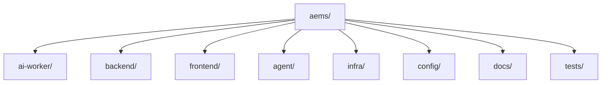

# 08 — Folder Structure

**Kiểu:** Monorepo, tách rõ `ai-worker`, `backend`, `frontend`, `agent`, `infra`, `docs`.

---

## 1. Tổng quan



---

## 2. Cây thư mục đầy đủ

```
aems/
├── README.md
├── docker-compose.yml
├── docker-compose.gpu.yml
├── .env.example
├── Makefile
│
├── config/                      # cấu hình tách khỏi code
│   ├── system.yaml
│   ├── models.yaml
│   ├── rules.yaml               # ngưỡng 7 hành vi
│   ├── cameras.example.yaml
│   └── logging.yaml
│
├── ai-worker/                   # AI pipeline (GPU)
│   ├── pyproject.toml
│   ├── Dockerfile
│   ├── src/
│   │   ├── main.py              # entrypoint worker
│   │   ├── config.py
│   │   ├── capture/
│   │   │   ├── rtsp_reader.py
│   │   │   ├── frame_queue.py
│   │   │   └── evidence_buffer.py   # ring buffer video
│   │   ├── inference/
│   │   │   ├── detector.py      # YOLO detect
│   │   │   ├── pose.py          # YOLO-pose
│   │   │   ├── tracker.py       # ByteTrack wrapper
│   │   │   ├── engine_trt.py    # TensorRT runtime
│   │   │   └── fusion.py        # fuse track+pose+object
│   │   ├── analytics/
│   │   │   ├── roi.py           # polygon, point-in-poly
│   │   │   ├── motion.py
│   │   │   ├── distance.py      # normalize scale
│   │   │   ├── facing.py        # hướng mặt từ pose
│   │   │   └── temporal.py      # sliding window, state
│   │   ├── rules/
│   │   │   ├── base.py          # Rule ABC + FSM
│   │   │   ├── registry.py      # load YAML/DB, hot-reload
│   │   │   ├── phone_usage.py
│   │   │   ├── away.py
│   │   │   ├── private_talk.py
│   │   │   ├── idle.py
│   │   │   ├── eating.py
│   │   │   ├── drowsiness.py
│   │   │   └── gathering.py
│   │   ├── alerting/
│   │   │   ├── alert_manager.py # dedup, cooldown, persist
│   │   │   └── evidence.py      # snapshot + clip
│   │   ├── bus/
│   │   │   ├── redis_bus.py     # streams + pubsub
│   │   │   └── contracts.py     # message schemas (versioned)
│   │   └── utils/
│   │       ├── geometry.py
│   │       ├── timing.py
│   │       └── logging.py
│   ├── models/                  # weights (.pt/.onnx/.engine) - gitignored
│   └── tests/
│       ├── test_rules_*.py
│       └── fixtures/            # golden clips / recorded inference
│
├── backend/                     # FastAPI
│   ├── pyproject.toml
│   ├── Dockerfile
│   ├── alembic.ini
│   ├── src/
│   │   ├── main.py              # app factory
│   │   ├── core/
│   │   │   ├── config.py
│   │   │   ├── security.py      # JWT, hashing, RBAC
│   │   │   ├── deps.py          # dependencies
│   │   │   └── errors.py
│   │   ├── db/
│   │   │   ├── session.py
│   │   │   ├── base.py
│   │   │   └── models/          # SQLAlchemy models
│   │   │       ├── user.py
│   │   │       ├── camera.py
│   │   │       ├── roi.py
│   │   │       ├── rule.py
│   │   │       ├── track.py
│   │   │       ├── alert.py
│   │   │       ├── evidence.py
│   │   │       ├── performance.py
│   │   │       └── log.py
│   │   ├── schemas/             # Pydantic v2
│   │   ├── api/
│   │   │   └── v1/
│   │   │       ├── auth.py
│   │   │       ├── cameras.py
│   │   │       ├── rois.py
│   │   │       ├── rules.py
│   │   │       ├── alerts.py
│   │   │       ├── tracks.py
│   │   │       ├── performance.py
│   │   │       ├── reports.py
│   │   │       ├── agent.py
│   │   │       └── ws.py        # websocket
│   │   ├── services/
│   │   │   ├── alert_service.py
│   │   │   ├── performance_service.py
│   │   │   ├── report_service.py
│   │   │   ├── telegram_service.py
│   │   │   └── storage_service.py  # MinIO/FS signed url
│   │   ├── workers/
│   │   │   ├── scheduler.py     # rollup, retention
│   │   │   └── notifier.py      # telegram retry queue
│   │   └── migrations/          # alembic versions
│   └── tests/
│
├── frontend/                    # React + Vite + TS
│   ├── package.json
│   ├── vite.config.ts
│   ├── Dockerfile
│   ├── index.html
│   └── src/
│       ├── main.tsx
│       ├── App.tsx
│       ├── api/                 # generated client + hooks
│       ├── store/               # zustand
│       ├── components/
│       │   ├── VideoOverlay.tsx # canvas bbox/roi
│       │   ├── AlertCard.tsx
│       │   ├── RoiEditor.tsx    # vẽ polygon
│       │   └── charts/
│       ├── pages/
│       │   ├── LiveDashboard.tsx
│       │   ├── Alerts.tsx
│       │   ├── EmployeeTimeline.tsx
│       │   ├── Performance.tsx
│       │   ├── Reports.tsx
│       │   ├── Heatmap.tsx
│       │   ├── Replay.tsx
│       │   └── admin/           # cameras/rois/rules/users
│       ├── hooks/
│       └── lib/                 # ws client, auth
│
├── agent/                       # Desktop Agent (tùy chọn, Windows)
│   ├── pyproject.toml
│   └── src/
│       ├── main.py              # thu kb/mouse idle
│       ├── collector.py
│       └── sender.py            # POST /agent/metrics
│
├── infra/
│   ├── nginx/
│   │   ├── nginx.conf
│   │   └── tls/
│   ├── postgres/
│   │   └── init.sql
│   ├── redis/
│   │   └── redis.conf
│   ├── minio/
│   ├── prometheus/
│   ├── grafana/
│   └── scripts/
│       ├── backup.ps1
│       └── restore.ps1
│
├── tests/                       # e2e/integration cross-service
│   ├── e2e/
│   └── load/                    # locust/k6
│
└── docs/                        # tài liệu thiết kế (bộ này)
```

---

## 3. Nguyên tắc tổ chức

| Nguyên tắc | Áp dụng |
|-----------|---------|
| Separation by service | ai-worker / backend / frontend / agent độc lập deploy |
| Config out of code | toàn bộ ngưỡng ở `config/*.yaml` |
| Contracts tập trung | `bus/contracts.py` versioned, dùng chung |
| Rules mỗi file 1 hành vi | dễ test, dễ thêm rule mới |
| Models gitignored | weight lớn → MinIO/registry, không commit |
| Tests cạnh code | unit gần module, e2e ở root |

---

## 4. Quy ước
- Python: `ruff` + `black` + `mypy`; layout `src/`.
- TS: `eslint` + `prettier`; path alias `@/`.
- Commit: Conventional Commits; branch `feat/`, `fix/`.
- Mỗi service có `Dockerfile` + healthcheck riêng.

## 5. Best Practices
- Thêm rule mới = thêm 1 file trong `rules/` + entry `rules.yaml` (không đụng core).
- Message contract đổi = tăng `schema_version`, cập nhật cả 2 phía.
- Tách `models.yaml` để đổi model không sửa code.

## 6. Risk / Performance (tóm tắt)
- Monorepo lớn → dùng workspace tooling + CI cache theo path thay đổi.
- Weight lớn làm image phồng → multi-stage build, mount volume models.
