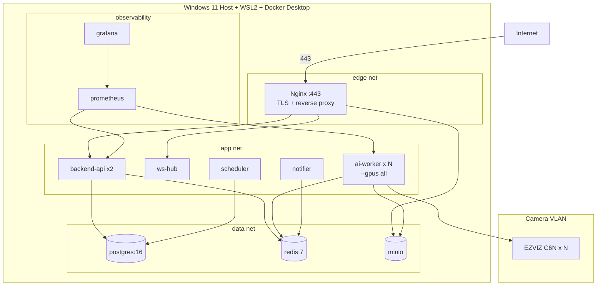
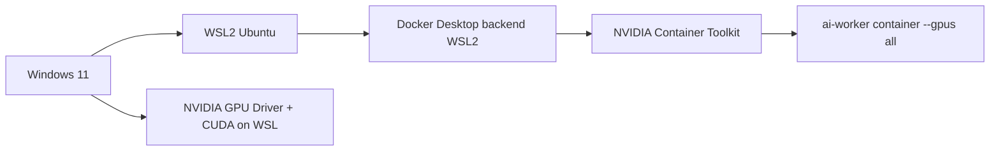
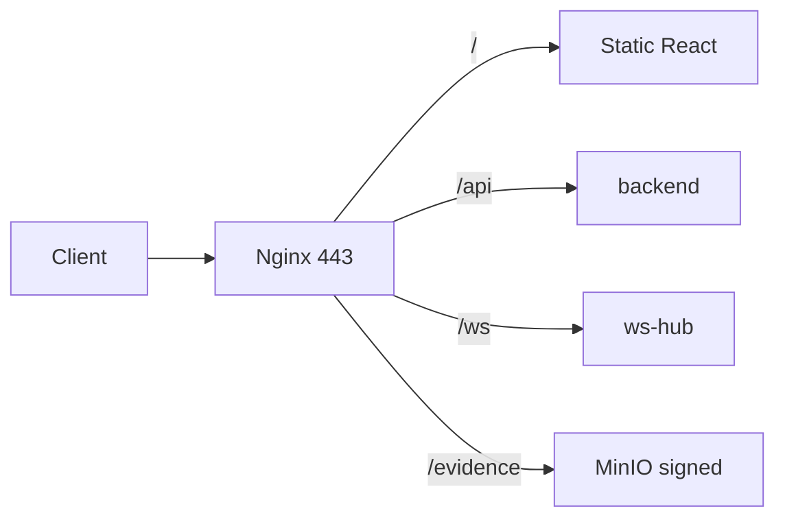
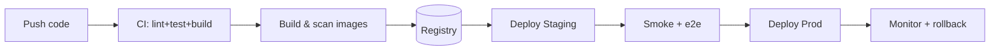

# 09 — Deployment Architecture

**Môi trường:** Windows 11 + GPU NVIDIA RTX. **Đóng gói:** Docker Compose. **Reverse proxy:** Nginx. **GPU:** NVIDIA Container Toolkit qua WSL2.

---

## 1. Sơ đồ triển khai



---

## 2. Dịch vụ & cấu hình container

| Service | Image base | GPU | Ports | Volume |
|---------|-----------|-----|-------|--------|
| nginx | nginx:alpine | no | 443,80 | tls, static FE |
| backend-api | python:3.12-slim | no | 8000(int) | — |
| ai-worker | nvidia/cuda:12.x-runtime + py3.12 | **yes** | — | models, evidence-tmp |
| scheduler | python:3.12-slim | no | — | — |
| notifier | python:3.12-slim | no | — | — |
| postgres | postgres:16 | no | 5432(int) | pgdata |
| redis | redis:7 | no | 6379(int) | redisdata (AOF) |
| minio | minio/minio | no | 9000(int) | miniodata |
| prometheus | prom/prometheus | no | 9090(int) | promdata |
| grafana | grafana/grafana | no | 3000(int) | grafanadata |

---

## 3. Docker Compose (mô tả cấu trúc)

```yaml
# docker-compose.yml (rút gọn — minh hoạ, chưa phải code triển khai)
services:
  nginx:
    image: nginx:alpine
    ports: ["443:443","80:80"]
    volumes:
      - ./infra/nginx/nginx.conf:/etc/nginx/nginx.conf:ro
      - ./infra/nginx/tls:/etc/nginx/tls:ro
      - frontend_dist:/usr/share/nginx/html:ro
    depends_on: [backend-api]
    networks: [edge, app]

  backend-api:
    build: ./backend
    env_file: .env
    depends_on: [postgres, redis, minio]
    deploy: { replicas: 2 }
    networks: [app, data]

  ai-worker:
    build: ./ai-worker
    env_file: .env
    gpus: all                      # NVIDIA runtime
    volumes:
      - ./config:/app/config:ro
      - models:/app/models
    depends_on: [redis, minio]
    networks: [app, camera]        # truy cập camera VLAN

  postgres: { image: postgres:16, volumes: [pgdata:/var/lib/postgresql/data], networks: [data] }
  redis:    { image: redis:7, command: ["redis-server","/etc/redis/redis.conf"], networks: [data] }
  minio:    { image: minio/minio, command: server /data --console-address ":9001", networks: [data] }

networks:
  edge: {}
  app: {}
  data: { internal: true }
  camera: {}
volumes: { pgdata: {}, redisdata: {}, miniodata: {}, models: {}, frontend_dist: {} }
```

> `docker-compose.gpu.yml` override thêm cấu hình NVIDIA cho `ai-worker` khi cần.

---

## 4. Yêu cầu GPU trên Windows 11



Checklist:
- Cài NVIDIA driver mới hỗ trợ WSL2 + CUDA.
- Bật WSL2 backend cho Docker Desktop.
- Cài NVIDIA Container Toolkit trong WSL.
- Kiểm tra: `docker run --rm --gpus all nvidia/cuda:12.x-base nvidia-smi`.

---

## 5. Nginx (vai trò)
- Terminate TLS (443), HTTP→HTTPS redirect.
- Serve static frontend (build Vite).
- Proxy `/api` → backend-api, `/ws` → ws-hub (upgrade), `/evidence` → MinIO (signed).
- Rate limit + gzip/br + security headers.



---

## 6. Môi trường & bí mật

| Loại | Cách quản lý |
|------|--------------|
| Secrets (DB pass, JWT key, Telegram token, camera cred key) | `.env` không commit; Docker secrets khi có swarm |
| Config runtime | `config/*.yaml` mount read-only |
| TLS cert | Let's Encrypt (nếu có domain) hoặc self-signed nội bộ |
| Model weights | volume `models` / MinIO, không trong image |

---

## 7. Vòng đời triển khai (CI/CD)



- Blue/green hoặc rolling cho `backend-api`.
- `ai-worker` triển khai theo camera group để không gián đoạn toàn bộ.
- DB migration qua Alembic bước riêng, có backup trước.

---

## 8. Backup & Khôi phục (DR)

| Đối tượng | Chiến lược | Tần suất |
|-----------|-----------|----------|
| PostgreSQL | pg_dump/WAL archiving | hàng ngày + WAL liên tục |
| MinIO evidence | mirror sang disk/NAS thứ 2 | hàng ngày |
| Config | git + backup .env (vault) | mỗi thay đổi |
| Redis | AOF | liên tục |

RTO mục tiêu < 4h, RPO < 24h (evidence), < 1h (metadata).

---

## 9. Giám sát vận hành
- Prometheus scrape: FPS/worker, queue depth, GPU util (dcgm-exporter), alert rate, API latency, DB connections.
- Grafana dashboards + alerting (camera offline, worker crash, disk > 85%).
- Log tập trung (stdout → Loki/ELK tùy chọn).

---

## 10. Best Practices
- `data` network `internal: true` — DB/Redis/MinIO không ra ngoài.
- Camera ở VLAN riêng; chỉ ai-worker route tới.
- Healthcheck + `restart: unless-stopped` cho auto-recover.
- Resource limits (mem/cpu) tránh 1 service ăn hết host.

## 11. Risk
- Docker Desktop/WSL2 GPU đôi khi kém ổn định → cân nhắc native Linux nếu scale lớn.
- Đơn host = SPOF → kế hoạch nhân bản/HA khi mở rộng.

## 12. Performance
- Pin CPU affinity cho grabber; GPU MPS nếu nhiều worker/GPU. Chi tiết tài liệu 15.
