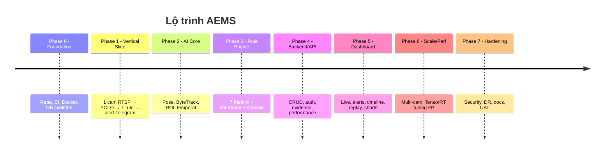
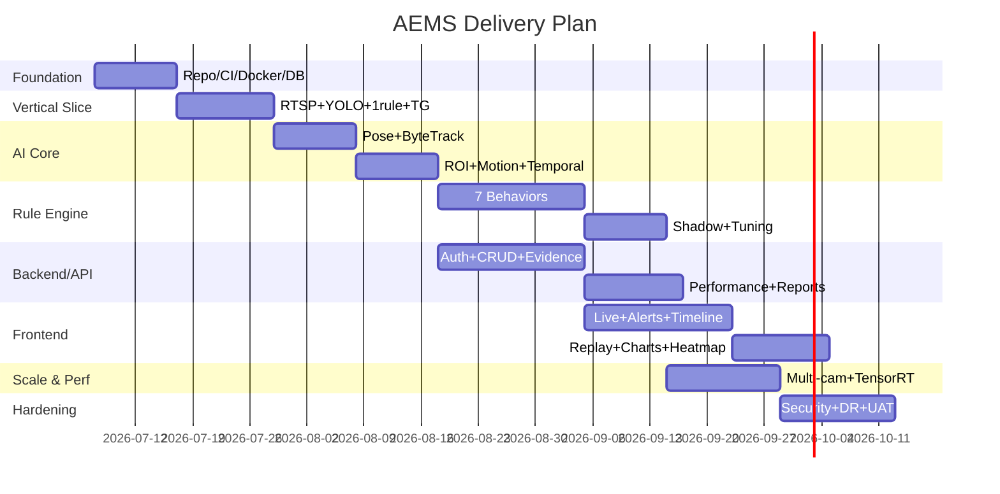

# 10 — Roadmap

**Cách tiếp cận:** phát triển theo phase, mỗi phase có mục tiêu đo lường được, ưu tiên đưa "1 camera + 1 rule end-to-end" chạy sớm (walking skeleton), sau đó mở rộng.

---

## 1. Tổng quan phase

---

## 2. Gantt

---

## 3. Chi tiết mục tiêu từng phase

| Phase | Mục tiêu | Deliverable | Định nghĩa hoàn thành (DoD) |
|-------|----------|-------------|------------------------------|
| P0 Foundation | Nền tảng dev | Monorepo, CI, docker-compose, DB migration, .env | `docker compose up` chạy stack rỗng, CI xanh |
| P1 Vertical Slice | Chứng minh khả thi | 1 camera → YOLO person → rule phone (đơn giản) → alert Telegram | Nhận 1 alert thật qua Telegram kèm ảnh |
| P2 AI Core | Perception đầy đủ | Pose + ByteTrack + ROI + motion + temporal buffer | Track ID ổn định, ROI gán đúng, tín hiệu ổn định |
| P3 Rule Engine | 7 hành vi | Đủ 7 rule + FSM + hot-reload + shadow mode | Mỗi rule pass golden clips, FP ≤ ngưỡng |
| P4 Backend/API | Dịch vụ | Auth/RBAC, CRUD, evidence storage, performance/report | API pass test, evidence lưu & signed URL |
| P5 Dashboard | UI | Live overlay, alerts, timeline, replay, charts, heatmap, ROI editor | Manager dùng được end-to-end |
| P6 Scale/Perf | Hiệu năng | Multi-cam, TensorRT, adaptive skip, tuning | Đạt NFR-PERF (≥4–8 cam/GPU) |
| P7 Hardening | Sẵn sàng SX | Security, DR, monitoring, docs, UAT | Pass security review + UAT ký nhận |

---

## 4. Cột mốc (Milestones)

| Milestone | Nội dung | Tiêu chí |
|-----------|----------|----------|
| M1 | Walking skeleton | Alert Telegram từ 1 camera |
| M2 | AI core hoàn chỉnh | Pose+track+ROI+temporal ổn định |
| M3 | Rule Engine đủ 7 | Shadow mode + tuning đạt precision mục tiêu |
| M4 | Beta nội bộ | Dashboard + backend đầy đủ, chạy 2–4 camera |
| M5 | Production-ready | Multi-cam, security, DR, UAT xong |

---

## 5. Chiến lược phát hành
- **Shadow-first:** rule chạy log-only trước khi bật alert thật.
- **Camera rollout theo nhóm:** mở rộng dần, tuning theo môi trường thực.
- **Feature flags:** bật/tắt từng rule, từng module.

## 6. Phụ thuộc & rủi ro tiến độ
- Dataset "food" custom cần chuẩn bị sớm (P2/P3).
- GPU/WSL2 setup có thể tốn thời gian (P0).
- Tuning FP là vòng lặp — dự phòng buffer thời gian ở P3b/P6.

## 7. Best Practices
- Ưu tiên vertical slice để giảm rủi ro tích hợp.
- Mỗi phase kết thúc bằng demo + retro.
- Đo lường (FP rate, FPS) từ sớm để định hướng tuning.
