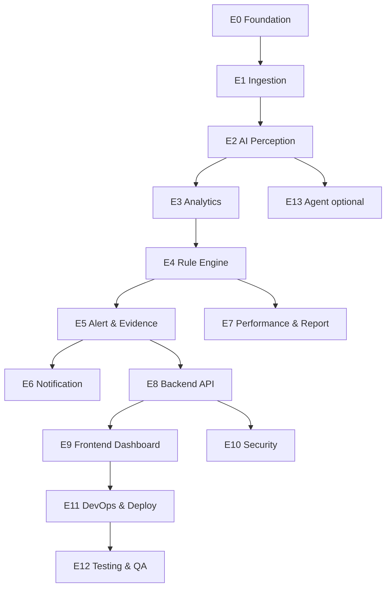

# 11 — Task Breakdown (WBS)

**Cấu trúc:** Epic → Story → Task. Estimate theo Story Point (SP, Fibonacci) và người phụ trách (role). Ưu tiên: P0 (cao) → P2 (thấp).

---

## 1. Bản đồ Epic

---

## 2. Chi tiết WBS

### E0 — Foundation
| ID | Task | Role | SP | Prio |
|----|------|------|----|----|
| E0-1 | Khởi tạo monorepo + tooling (ruff/black/eslint) | DevOps | 3 | P0 |
| E0-2 | docker-compose skeleton (pg/redis/minio/nginx) | DevOps | 5 | P0 |
| E0-3 | DB models + Alembic init | DB Architect | 5 | P0 |
| E0-4 | CI pipeline (lint/test/build) | DevOps | 5 | P0 |
| E0-5 | Config loader YAML + settings | Backend | 3 | P0 |

### E1 — Ingestion
| ID | Task | Role | SP | Prio |
|----|------|------|----|----|
| E1-1 | RTSP reader + reconnect backoff | CV | 5 | P0 |
| E1-2 | Frame queue bounded + drop policy | CV | 5 | P0 |
| E1-3 | Evidence ring buffer (video) | CV | 5 | P0 |
| E1-4 | Camera health monitor | Backend | 3 | P1 |
| E1-5 | Sub/main stream handling | CV | 3 | P1 |

### E2 — AI Perception
| ID | Task | Role | SP | Prio |
|----|------|------|----|----|
| E2-1 | YOLO detector wrapper (person+object) | ML | 5 | P0 |
| E2-2 | YOLO-pose integration | ML | 5 | P0 |
| E2-3 | ByteTrack integration + tune | ML | 8 | P0 |
| E2-4 | Fusion track↔pose↔object | ML | 5 | P0 |
| E2-5 | TensorRT export + runtime | ML | 8 | P1 |
| E2-6 | Food class custom dataset + fine-tune | ML | 13 | P1 |
| E2-7 | Face detection (optional) | ML | 5 | P2 |

### E3 — Analytics
| ID | Task | Role | SP | Prio |
|----|------|------|----|----|
| E3-1 | ROI polygon + point-in-poly | CV | 3 | P0 |
| E3-2 | Distance normalization (scale) | CV | 5 | P0 |
| E3-3 | Motion analyzer | CV | 5 | P0 |
| E3-4 | Facing vector từ pose | CV | 5 | P1 |
| E3-5 | Temporal sliding window store | Backend | 5 | P0 |

### E4 — Rule Engine
| ID | Task | Role | SP | Prio |
|----|------|------|----|----|
| E4-1 | Rule base ABC + FSM + debounce/hysteresis | Backend/ML | 8 | P0 |
| E4-2 | Registry + YAML/DB load + hot-reload | Backend | 5 | P0 |
| E4-3 | Rule: phone_usage | ML | 5 | P0 |
| E4-4 | Rule: away | ML | 3 | P0 |
| E4-5 | Rule: private_talk | ML | 8 | P1 |
| E4-6 | Rule: idle (+agent fusion) | ML | 5 | P1 |
| E4-7 | Rule: eating | ML | 5 | P1 |
| E4-8 | Rule: drowsiness | ML | 5 | P1 |
| E4-9 | Rule: gathering (DBSCAN) | ML | 5 | P1 |
| E4-10 | Shadow mode + threshold tuning harness | ML | 8 | P1 |

### E5 — Alert & Evidence
| ID | Task | Role | SP | Prio |
|----|------|------|----|----|
| E5-1 | Alert manager: dedup+cooldown+persist | Backend | 5 | P0 |
| E5-2 | Snapshot generator (bbox overlay) | CV | 3 | P0 |
| E5-3 | Video clip extractor từ ring buffer | CV | 5 | P0 |
| E5-4 | Storage service MinIO + signed URL | Backend | 5 | P0 |

### E6 — Notification
| ID | Task | Role | SP | Prio |
|----|------|------|----|----|
| E6-1 | Telegram sender (photo+video+meta) | Backend | 5 | P0 |
| E6-2 | Retry queue + backoff | Backend | 3 | P1 |

### E7 — Performance & Report
| ID | Task | Role | SP | Prio |
|----|------|------|----|----|
| E7-1 | Time-bucket aggregator | Backend | 5 | P1 |
| E7-2 | Score formula (configurable) | Backend | 5 | P1 |
| E7-3 | Daily/weekly rollup scheduler | Backend | 5 | P1 |
| E7-4 | Report export CSV/PDF | Backend | 5 | P2 |
| E7-5 | Heatmap data | Backend | 3 | P2 |

### E8 — Backend API
| ID | Task | Role | SP | Prio |
|----|------|------|----|----|
| E8-1 | Auth JWT + RBAC | Backend/Sec | 8 | P0 |
| E8-2 | CRUD cameras/rois/rules | Backend | 8 | P0 |
| E8-3 | Alerts/tracks/timeline API | Backend | 5 | P0 |
| E8-4 | Performance/reports API | Backend | 5 | P1 |
| E8-5 | WebSocket hub (live+alerts) | Backend | 8 | P0 |
| E8-6 | Agent metrics endpoint | Backend | 3 | P2 |

### E9 — Frontend Dashboard
| ID | Task | Role | SP | Prio |
|----|------|------|----|----|
| E9-1 | Auth + layout + routing | Frontend | 5 | P0 |
| E9-2 | Live view + canvas overlay + WS | Frontend | 8 | P0 |
| E9-3 | ROI editor (vẽ polygon) | Frontend | 8 | P0 |
| E9-4 | Alerts list + detail + review | Frontend | 5 | P0 |
| E9-5 | Employee timeline | Frontend | 5 | P1 |
| E9-6 | Replay evidence | Frontend | 5 | P1 |
| E9-7 | Performance + charts | Frontend | 5 | P1 |
| E9-8 | Heatmap | Frontend | 5 | P2 |
| E9-9 | Admin (cameras/rules/users) | Frontend | 8 | P1 |

### E10 — Security
| ID | Task | Role | SP | Prio |
|----|------|------|----|----|
| E10-1 | Secret mgmt + credential encryption | Security | 5 | P0 |
| E10-2 | TLS + Nginx hardening | Security/DevOps | 3 | P0 |
| E10-3 | Audit logging | Backend | 3 | P1 |
| E10-4 | Rate limit + input validation review | Security | 3 | P1 |
| E10-5 | Privacy/legal compliance pack | Security | 5 | P0 |

### E11 — DevOps & Deploy
| ID | Task | Role | SP | Prio |
|----|------|------|----|----|
| E11-1 | GPU compose + NVIDIA toolkit setup | DevOps | 5 | P0 |
| E11-2 | Prometheus+Grafana + dcgm | DevOps | 5 | P1 |
| E11-3 | Backup/restore scripts | DevOps | 5 | P1 |
| E11-4 | CD staging/prod + migrations | DevOps | 8 | P1 |

### E12 — Testing & QA
| ID | Task | Role | SP | Prio |
|----|------|------|----|----|
| E12-1 | Unit tests core + rules | All | 8 | P0 |
| E12-2 | Golden clips fixtures | ML/QA | 8 | P1 |
| E12-3 | Integration (pipeline replay) | QA | 5 | P1 |
| E12-4 | E2E dashboard | QA | 5 | P1 |
| E12-5 | Load test (multi-cam) | DevOps | 5 | P1 |

### E13 — Agent (optional)
| ID | Task | Role | SP | Prio |
|----|------|------|----|----|
| E13-1 | Windows agent kb/mouse collector | Backend | 5 | P2 |
| E13-2 | Secure sender + token | Security | 3 | P2 |

---

## 3. Tổng hợp effort (ước lượng)

| Epic | Tổng SP |
|------|---------|
| E0 | 21 |
| E1 | 21 |
| E2 | 49 |
| E3 | 23 |
| E4 | 62 |
| E5 | 18 |
| E6 | 8 |
| E7 | 23 |
| E8 | 37 |
| E9 | 54 |
| E10 | 19 |
| E11 | 23 |
| E12 | 31 |
| E13 | 8 |
| **Tổng** | **~397 SP** |

> Với team ~4–5 kỹ sư, velocity ~30–40 SP/sprint (2 tuần) → khoảng **10–13 sprint (~5–6 tháng)** cho bản production-ready, có buffer tuning FP.

---

## 4. Ma trận phụ trách (RACI rút gọn)

| Hạng mục | Architect | CV | ML | Backend | Frontend | DBA | DevOps | Sec |
|----------|:--:|:--:|:--:|:--:|:--:|:--:|:--:|:--:|
| AI pipeline | C | R | R | C | | | C | |
| Rule engine | A | C | R | R | | | | |
| Backend/API | C | | | R | C | C | | C |
| Frontend | | | | C | R | | | |
| DB/Storage | C | | | C | | R | C | C |
| Deploy | A | | | C | | | R | C |
| Security | C | | | C | | C | C | R |

R=Responsible, A=Accountable, C=Consulted.

## 5. Best Practices
- Định nghĩa DoD cho mỗi story (test + docs + review).
- Track FP rate như một "story" xuyên suốt, không chỉ 1 lần.
