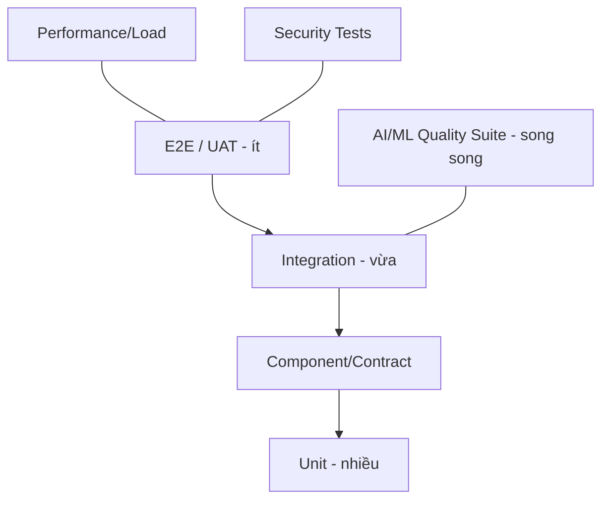
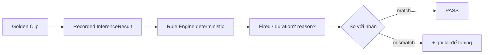
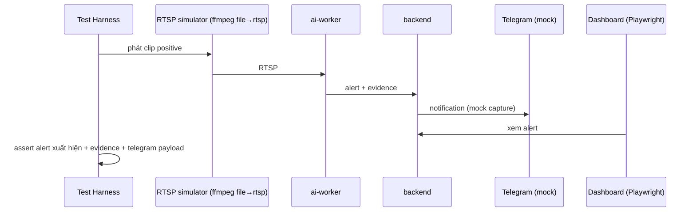

# 12 — Test Plan

**Mục tiêu:** đảm bảo chức năng đúng, **False Positive thấp**, hiệu năng đạt NFR, và an toàn khi vận hành. Trọng tâm đặc thù: **kiểm thử Rule Engine bằng dữ liệu gán nhãn (golden clips) và replay tất định**.

---

## 1. Kim tự tháp kiểm thử



---

## 2. Phạm vi & loại test

| Loại | Đối tượng | Công cụ | Mục tiêu |
|------|-----------|---------|----------|
| Unit | geometry, ROI, rule FSM, score | pytest | coverage ≥ 70% core, ≥ 90% rules |
| Contract | message schema Redis/WS/REST | pydantic/schemathesis | không phá vỡ hợp đồng |
| Component | detector/tracker/pose wrapper | pytest + fixtures | output đúng định dạng |
| Integration | pipeline replay end-to-end | pytest + recorded frames | rule kích hoạt đúng |
| AI Quality | mAP/precision model; FP/FN rule | eval scripts | đạt ngưỡng chất lượng |
| E2E | UI → API → alert → Telegram | Playwright | luồng nghiệp vụ |
| Performance | FPS, latency, GPU, queue | k6/locust + custom | đạt NFR-PERF |
| Security | authz, injection, secrets | OWASP ZAP, bandit | không lỗ hổng nghiêm trọng |
| Chaos/Resilience | mất RTSP/DB/Redis | scripts | tự phục hồi |

---

## 3. Kiểm thử Rule Engine (trọng tâm)

### 3.1 Golden Clips Dataset
Mỗi hành vi có bộ clip gán nhãn:
- **Positive:** hành vi thật sự xảy ra (đủ thời lượng).
- **Hard-negative:** dễ gây FP (phone trên bàn không cầm, cúi đọc tài liệu, hai người ngồi cạnh làm việc, đi ngang qua...).



### 3.2 Ma trận test case Rule (trích)

| TC | Rule | Kịch bản | Kỳ vọng |
|----|------|----------|---------|
| TC-RE-01 | phone | Cầm phone 12s | Alert sau ~10s |
| TC-RE-02 | phone | Phone trên bàn 60s, không cầm | Không alert |
| TC-RE-03 | phone | Cầm phone 6s rồi bỏ | Không alert |
| TC-RE-04 | away | Ra khỏi ROI 6 phút (giờ làm) | Alert sau 5 phút |
| TC-RE-05 | away | Ra khỏi ROI 3 phút | Không alert |
| TC-RE-06 | away | Occlusion 8s (track lost) | Không alert (grace) |
| TC-RE-07 | talk | 2 người quay vào nhau 2.5 phút | Alert |
| TC-RE-08 | talk | 2 người ngồi cạnh cùng làm việc | Không alert |
| TC-RE-09 | idle | Không thao tác 15 phút (no agent) | Alert |
| TC-RE-10 | idle | Đọc tài liệu có cử động | Không alert |
| TC-RE-11 | eating | Ăn lặp lại > 60s | Alert |
| TC-RE-12 | eating | Uống 1 ngụm nhanh | Không alert |
| TC-RE-13 | drowsy | Gục đầu bất động 25s | Alert |
| TC-RE-14 | drowsy | Cúi viết 30s (có motion) | Không alert |
| TC-RE-15 | gather | 3 người tụ 2.5 phút | Alert |
| TC-RE-16 | gather | 3 người đi ngang qua | Không alert |

### 3.3 Metric chất lượng rule
```
Precision = TP / (TP + FP)     ← ưu tiên cao
Recall    = TP / (TP + FN)
F1        = 2PR/(P+R)
FP rate/hour = FP / giờ giám sát
```
Ngưỡng chấp nhận (mục tiêu sau tuning): **Precision ≥ 0.90**, **FP rate/hour** thấp theo thỏa thuận.

---

## 4. Kiểm thử AI model

| Test | Cách làm | Ngưỡng |
|------|----------|--------|
| Detection mAP | Eval trên bộ office gán nhãn | mAP50 ≥ 0.6 person/phone |
| Track stability | ID switch rate trên clip đông người | thấp (đo baseline) |
| Pose accuracy | PCK trên keypoints | đạt baseline model |
| Robustness | Đổi ánh sáng/góc | không sụt > X% |

---

## 5. Kiểm thử tích hợp & E2E



- **RTSP simulator:** dùng ffmpeg đẩy file video thành RTSP để test lặp lại được.
- **Telegram mock:** server giả bắt request để assert payload (ảnh/video/meta).

---

## 6. Performance test

| Kịch bản | Tham số | Tiêu chí |
|----------|---------|----------|
| Single cam | 1080p sub 15fps | ≥ 13 FPS xử lý |
| Multi cam | 4 → 8 cam / 1 GPU | không lag > ngưỡng, queue ổn định |
| Alert burst | nhiều vi phạm đồng thời | không mất alert, Telegram không nghẽn |
| API load | 100+ client dashboard | p95 latency < 300ms |
| WS scale | nhiều viewer live | không drop kết nối |

Công cụ: k6/locust (API/WS), script đo FPS/latency/GPU (nvidia-smi/dcgm).

---

## 7. Chaos / Resilience

| Sự cố tiêm | Kỳ vọng |
|-----------|---------|
| Kill RTSP | camera offline, reconnect, alert hệ thống, camera khác không ảnh hưởng |
| Redis down | degrade an toàn, không crash worker |
| DB down | buffer WAL, replay khi phục hồi |
| GPU OOM | giảm tải/fallback, log rõ |
| Telegram timeout | retry queue, không mất notification |

---

## 8. Môi trường test

| Env | Mục đích | Dữ liệu |
|-----|----------|---------|
| local | dev unit/integration | clip mẫu, DB ephemeral |
| CI | tự động PR | fixtures + mock |
| staging | e2e/perf/UAT | vài camera thật |
| prod | smoke sau deploy | health checks |

---

## 9. Tiêu chí ra (Exit criteria)
- 100% test P0 pass; không bug severity ≥ High mở.
- Precision rule đạt mục tiêu trên staging.
- NFR-PERF đạt với ≥ 4 camera.
- Security scan không có lỗ hổng Critical/High.
- UAT được HR/Manager ký nhận.

## 10. Best Practices
- Deterministic replay để test rule ổn định, không phụ thuộc GPU.
- Tách "AI quality" khỏi "software correctness".
- Lưu mọi FP/FN thật từ production làm test case hồi quy.

## 11. Risk / Performance (tóm tắt)
- Thiếu dữ liệu gán nhãn office → ưu tiên thu thập sớm.
- Test GPU cần runner có GPU → dùng self-hosted runner.
