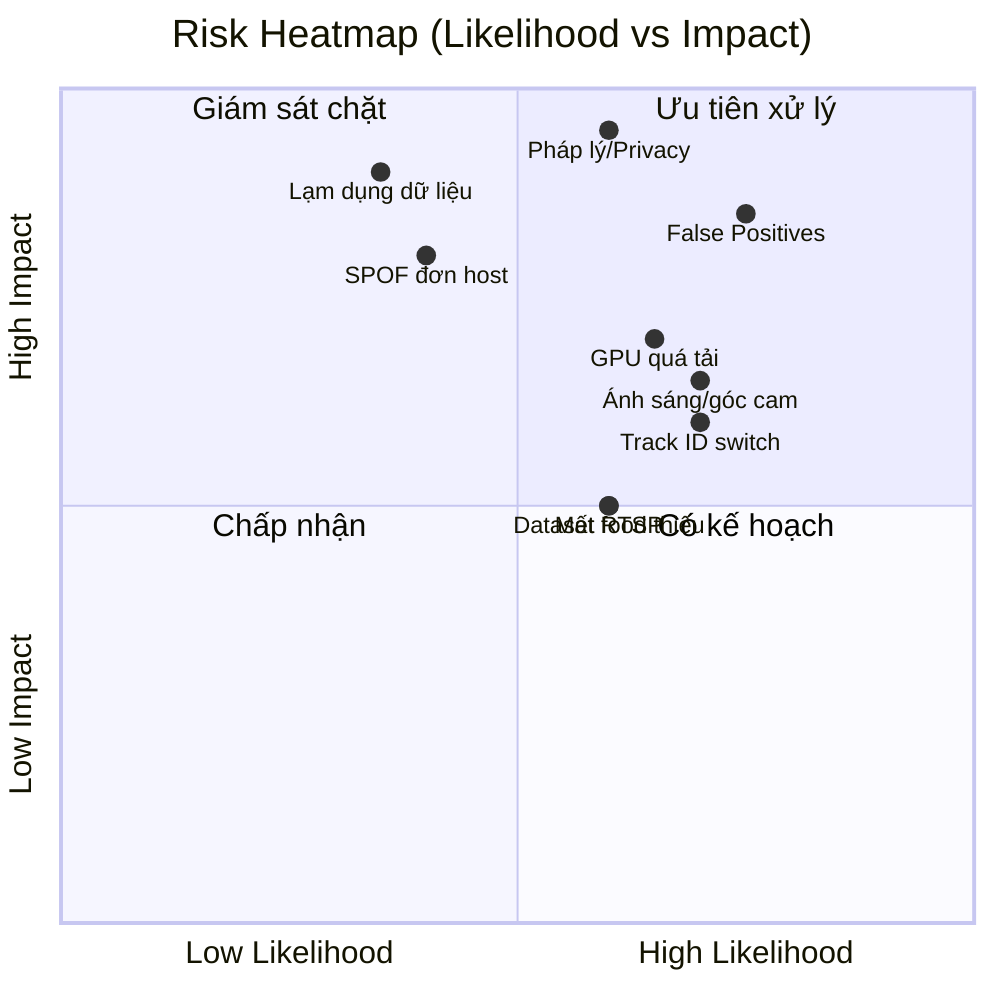
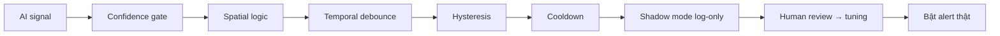

# 13 — Risk Analysis

**Phương pháp:** Risk = Likelihood × Impact (thang 1–5). Xếp hạng và đề ra biện pháp giảm thiểu (mitigation) + kế hoạch dự phòng (contingency).

---

## 1. Bản đồ nhiệt rủi ro

---

## 2. Sổ đăng ký rủi ro (Risk Register)

| ID | Rủi ro | Loại | L | I | Score | Mitigation | Contingency |
|----|--------|------|---|---|-------|-----------|-------------|
| R-01 | **False Positive cao** làm mất niềm tin & rủi ro pháp lý | Sản phẩm | 4 | 5 | 20 | Rule+temporal+hysteresis, shadow mode, tuning, hard-negative tests | Tăng ngưỡng, tắt rule nhạy, review thủ công |
| R-02 | **Vi phạm pháp luật/quyền riêng tư** giám sát nhân viên | Pháp lý | 3 | 5 | 15 | Thông báo & đồng thuận, chính sách, masking, retention tối thiểu, DPIA | Tạm dừng, tư vấn pháp lý, thu hẹp phạm vi |
| R-03 | **GPU quá tải** khi tăng camera | Kỹ thuật | 4 | 4 | 16 | Sub-stream, TensorRT, adaptive skip, batch, thêm GPU/worker | Giảm FPS/độ phân giải, ưu tiên camera quan trọng |
| R-04 | **Track ID switch** phá temporal rule | AI | 4 | 3 | 12 | Tune ByteTrack, grace period, ROI↔employee binding | Dựa nhiều hơn vào ROI, giảm phụ thuộc ID |
| R-05 | **Điều kiện ánh sáng/góc camera** kém → accuracy giảm | Môi trường | 4 | 3 | 12 | Khảo sát lắp đặt, fine-tune domain, ngưỡng theo camera | Bổ sung đèn, đổi vị trí camera |
| R-06 | **Mất RTSP / camera lỗi** | Vận hành | 3 | 3 | 9 | Reconnect backoff, health monitor, bulkhead | Cảnh báo IT, camera dự phòng |
| R-07 | **Dataset "food" thiếu** → detect kém | AI | 3 | 3 | 9 | Thu thập & fine-tune sớm, dùng nhóm COCO tạm | Hạ ưu tiên rule eating |
| R-08 | **Đơn host = SPOF** | Hạ tầng | 2 | 4 | 8 | Backup/DR, healthcheck, restart policy | Chuyển sang multi-node/HA |
| R-09 | **Lạm dụng dữ liệu giám sát** nội bộ | Quản trị | 2 | 5 | 10 | RBAC, audit log, tối thiểu quyền, mã hóa | Điều tra audit, thu hồi quyền |
| R-10 | **Rò rỉ credential camera/secret** | Bảo mật | 2 | 4 | 8 | Mã hóa, secret store, VLAN cách ly | Xoay khóa, cô lập mạng |
| R-11 | **Chi phí lưu trữ evidence phình to** | Vận hành | 3 | 3 | 9 | Retention, nén, chỉ lưu clip vi phạm | Giảm thời lượng clip, tăng disk |
| R-12 | **WSL2/GPU không ổn định trên Windows** | Hạ tầng | 3 | 3 | 9 | Test kỹ, pin driver, doc setup | Chuyển native Linux |
| R-13 | **Nhân viên phản đối/tinh thần giảm** | Con người | 3 | 4 | 12 | Minh bạch mục tiêu, dùng cho cải thiện không phạt tự động | Điều chỉnh chính sách, truyền thông |
| R-14 | **Scope creep** (thêm nhận diện hành vi trực tiếp) | Dự án | 3 | 3 | 9 | Bám triết lý rule-based, change control | Đánh giá lại roadmap |
| R-15 | **Overfitting ngưỡng** cho 1 môi trường | AI | 3 | 3 | 9 | Test đa môi trường, config per-camera | Tuning lại theo site |

L=Likelihood, I=Impact (1–5).

---

## 3. Top rủi ro & kế hoạch chi tiết

### R-01 False Positive (điểm cao nhất)

- KPI theo dõi: FP rate/hour theo rule; mục tiêu giảm dần mỗi tuần tuning.

### R-02 Pháp lý & Privacy
- Bắt buộc trước go-live: chính sách giám sát, thông báo nhân viên, cơ sở pháp lý, DPIA (xem tài liệu 14).
- Masking vùng không liên quan; không thu âm thanh; retention tối thiểu.

### R-03 GPU quá tải
- Ngân sách latency & benchmark (tài liệu 15); cảnh báo GPU util > 85%.

---

## 4. Giám sát rủi ro (KRI)

| Rủi ro | Chỉ số cảnh báo sớm (KRI) | Ngưỡng |
|--------|---------------------------|--------|
| R-01 | FP rate/hour | > mục tiêu |
| R-03 | GPU util, queue depth | > 85%, tăng liên tục |
| R-04 | ID switch rate | > baseline |
| R-06 | camera offline count | > 0 kéo dài |
| R-11 | disk usage evidence | > 80% |

---

## 5. Quy trình quản lý rủi ro
- Review risk register mỗi sprint.
- Rủi ro mới từ retro/production → thêm vào register.
- Owner rõ ràng cho mỗi rủi ro Score ≥ 12.

## 6. Best Practices
- "Precision over recall" là kim chỉ nam giảm R-01.
- Privacy-by-design & minimization giảm R-02/R-09.
- Bulkhead & health monitor giảm R-06/R-08.
