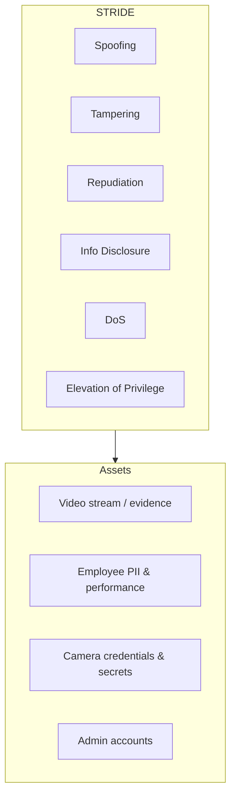
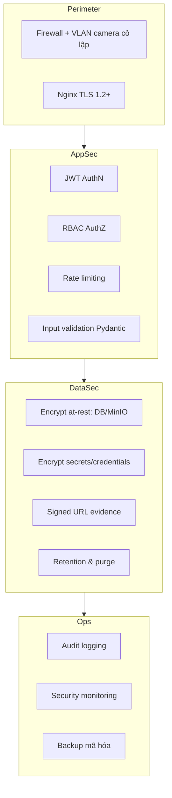
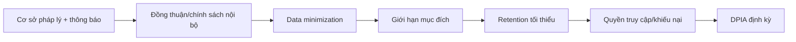

# 14 — Security & Privacy Analysis

Hệ thống xử lý **dữ liệu sinh trắc/hành vi nhạy cảm của con người** → bảo mật và tuân thủ pháp lý là điều kiện bắt buộc để go-live, không phải tùy chọn.

---

## 1. Mô hình đe dọa (STRIDE)

| STRIDE | Đe dọa | Kiểm soát |
|--------|--------|-----------|
| Spoofing | Giả mạo user/agent/camera | JWT, agent token, mTLS nội bộ, allowlist IP camera |
| Tampering | Sửa evidence/alert | Hash evidence, audit log, DB constraint, WORM tùy chọn |
| Repudiation | Chối bỏ hành động admin | Audit log bất biến, đồng bộ thời gian |
| Info Disclosure | Lộ video/PII | TLS, mã hóa at-rest, signed URL, RBAC, minimization |
| DoS | Làm nghẽn API/WS/pipeline | Rate limit, backpressure, resource limits |
| Elevation | Leo thang quyền | RBAC chặt, least privilege, tách network |

---

## 2. Kiến trúc bảo mật theo tầng (Defense in Depth)

---

## 3. Kiểm soát chính

### 3.1 Authentication & Authorization
- Mật khẩu hash **Argon2id**; chính sách độ mạnh; khóa sau nhiều lần sai.
- JWT access ngắn (15'), refresh rotate + revoke list (Redis).
- **RBAC** 4 vai trò (admin/hr/manager/auditor); manager chỉ thấy phòng ban mình.
- MFA cho admin (khuyến nghị).

### 3.2 Bảo vệ dữ liệu
| Dữ liệu | At-rest | In-transit | Truy cập |
|---------|---------|-----------|----------|
| Video/evidence | Mã hóa disk/MinIO SSE | TLS + signed URL | RBAC, hết hạn URL |
| PII nhân viên | Mã hóa cột nhạy cảm | TLS | RBAC |
| Camera credentials | Mã hóa app-level (KMS/Fernet) | TLS | chỉ worker |
| Secrets (JWT/Telegram) | Secret store/.env bảo vệ | — | chỉ service |

### 3.3 Cách ly mạng
- Camera ở **VLAN riêng**, không Internet, chỉ ai-worker truy cập.
- DB/Redis/MinIO ở network `internal` (không expose).
- Chỉ Nginx expose 443.

### 3.4 Audit & giám sát
- Ghi mọi hành động quản trị (ai, khi nào, gì) → `audit_logs` bất biến.
- Giám sát đăng nhập bất thường, truy cập evidence, thay đổi rule.

---

## 4. Quyền riêng tư & tuân thủ pháp lý (rất quan trọng)

| Nguyên tắc | Áp dụng cho AEMS |
|-----------|------------------|
| Tính hợp pháp & minh bạch | Thông báo nhân viên, nội quy/hợp đồng nêu rõ giám sát |
| Giới hạn mục đích | Chỉ dùng cho quản lý hiệu suất/an toàn, không mục đích khác |
| Tối thiểu dữ liệu | Che vùng ngoài khu làm việc; **không thu âm thanh**; không face recognition ở v1 |
| Giới hạn lưu trữ | Retention ngắn cho video; xóa tự động |
| Chính xác & công bằng | Score minh bạch, có review người; không phạt tự động |
| Quyền của cá nhân | Kênh khiếu nại/đính chính; hạn chế lạm dụng |
| Trách nhiệm giải trình | DPIA, audit, phân quyền |

**Khuyến nghị pháp lý bắt buộc trước go-live:**
1. Tham vấn bộ phận pháp chế/nhân sự theo luật lao động & bảo vệ dữ liệu địa phương.
2. Thông báo và (nếu luật yêu cầu) lấy đồng thuận nhân viên.
3. Thực hiện **DPIA** (đánh giá tác động quyền riêng tư).
4. Ban hành chính sách sử dụng dữ liệu & thời hạn lưu.
5. Loại khu vực nhạy cảm (nghỉ, WC, y tế) khỏi giám sát.

> **Lưu ý:** Giám sát nhân viên bằng camera + AI chịu ràng buộc pháp lý khác nhau theo quốc gia/khu vực. Đây là hướng dẫn kỹ thuật, **không thay thế tư vấn pháp lý**.

---

## 5. Bảo mật chuỗi cung ứng & vận hành
- Quét dependency (pip-audit), quét image (Trivy), SAST (bandit/semgrep) trong CI.
- Pin phiên bản; cập nhật bản vá định kỳ.
- Ký & xác minh image; registry riêng tư.
- Backup **mã hóa**, test restore định kỳ.
- Nguyên tắc least privilege cho service accounts.

---

## 6. Checklist an ninh trước go-live

| Hạng mục | Trạng thái mục tiêu |
|----------|---------------------|
| TLS mọi endpoint public | ✔ |
| RBAC + least privilege | ✔ |
| Mã hóa at-rest DB/MinIO | ✔ |
| Credential camera mã hóa | ✔ |
| Camera VLAN cô lập | ✔ |
| Rate limit + validation | ✔ |
| Audit log bật | ✔ |
| Retention & purge chạy | ✔ |
| Secret không nằm trong code/image | ✔ |
| DPIA + thông báo nhân viên | ✔ |
| Pen-test/scan không lỗ hổng Critical/High | ✔ |
| Backup mã hóa + test restore | ✔ |

---

## 7. Best Practices
- **Privacy-by-design & by-default** ngay từ kiến trúc.
- Tối thiểu hóa: chỉ lưu evidence khi có vi phạm; nén & hết hạn.
- Không dùng dữ liệu để phạt tự động — luôn có con người review.
- Tách rõ ranh giới tin cậy; giả định "breach" và giới hạn thiệt hại.

## 8. Risk liên quan (xem tài liệu 13)
- R-02 pháp lý/privacy, R-09 lạm dụng, R-10 rò rỉ credential.

## 9. Performance liên quan
- TLS/mã hóa thêm overhead nhỏ; signed URL & CDN nội bộ giảm tải; chi tiết tài liệu 15.
