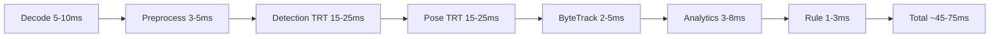
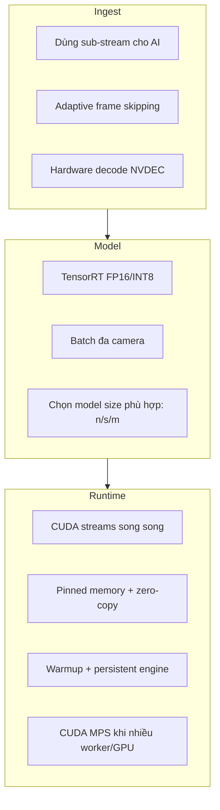
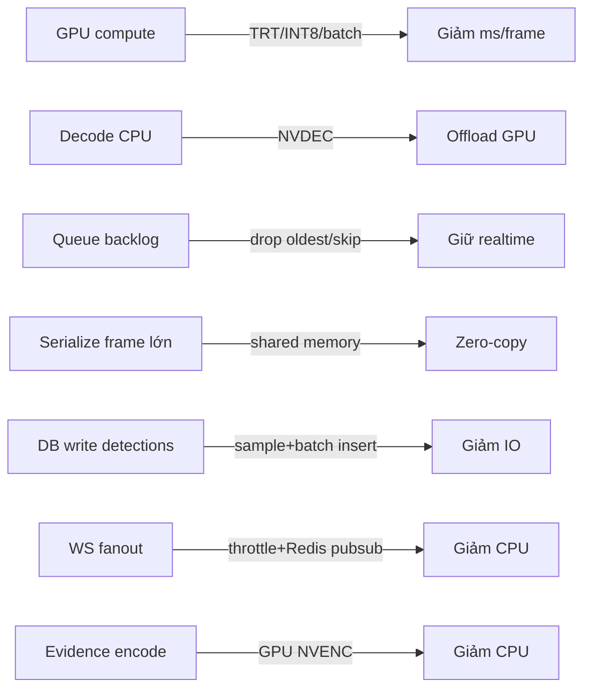
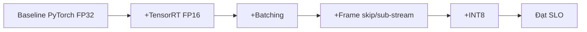

# 15 — Performance Analysis

**Mục tiêu:** đạt realtime đa camera trên 1 GPU RTX, độ trễ thấp, ổn định dưới tải, và chi phí tài nguyên hợp lý.

---

## 1. Mục tiêu hiệu năng (SLO)

| Chỉ số | Mục tiêu |
|--------|----------|
| FPS xử lý / camera | ≥ 12–15 (sub-stream 720p/960px) |
| Camera / 1 GPU RTX | 4–8 (tùy model & độ đông cảnh) |
| Latency sự kiện → alert Telegram | ≤ 5s (ngoài thời gian debounce) |
| Latency pipeline / frame | ≤ 70ms |
| API p95 | < 300ms |
| WS fanout | ≥ 100 viewer không drop |
| GPU utilization | 60–85% (headroom an toàn) |

---

## 2. Ngân sách độ trễ pipeline (per frame @ sub-stream)



| Bước | Tối ưu chính |
|------|--------------|
| Decode | NVDEC hardware decode, giảm FPS đầu vào |
| Preprocess | GPU letterbox, pinned memory, batch |
| Detection/Pose | TensorRT FP16/INT8, batch đa camera |
| Tracking/Analytics | vectorize NumPy, tránh Python loop nặng |
| Rule | state trong RAM, O(tracks) |

---

## 3. Chiến lược tối ưu GPU



### 3.1 Đòn bẩy lớn nhất
1. **Sub-stream + frame skip:** không chạy AI ở 1080p/30fps; dùng 720p/10–15fps.
2. **TensorRT FP16:** tăng 2–3× throughput so với PyTorch FP32.
3. **Batch đa camera:** bão hòa GPU, giảm overhead per-call.
4. **Model phù hợp:** YOLO11s cho GPU yếu, m cho mạnh; đo trước khi chọn.

---

## 4. Ước tính năng lực (capacity planning)

Giả định detection+pose ~40ms/frame (FP16, 640) trên 1 GPU:

| FPS/cam | ms budget/cam | Camera / GPU (100% lý thuyết) | An toàn (70%) |
|---------|---------------|-------------------------------|---------------|
| 10 | 100ms | ~2.5 batch-slot | 4–5 với batching |
| 15 | 66ms | ~1.6 | 3–4 |
| 8 | 125ms | ~3 | 6–8 |

> **Kết luận:** với frame skip xuống ~8–10 FPS và batching + TRT, **6–8 camera / 1 GPU RTX** là khả thi cho cảnh văn phòng thưa người. Cảnh đông người (nhiều box) sẽ giảm số camera.

Công thức thô:
```
cameras_per_gpu ≈ (1000ms × gpu_util_target) / (fps_per_cam × ms_per_frame_effective)
```
với `ms_per_frame_effective` giảm nhờ batching.

---

## 5. Bottleneck & cách xử lý



| Bottleneck | Triệu chứng | Giải pháp |
|-----------|-------------|-----------|
| GPU compute | GPU 100%, FPS tụt | TRT/INT8, model nhỏ hơn, thêm GPU |
| CPU decode | CPU cao, GPU rảnh | NVDEC hardware decode |
| Queue lag | độ trễ tăng dần | adaptive skip, drop oldest |
| Frame serialize | CPU/mem cao | shared memory / zero-copy |
| DB writes | disk IO cao | sample detections, batch insert, hypertable |
| WS | CPU backend cao | throttle 5–10fps, pubsub, giới hạn viewer |
| Evidence | CPU khi ghi video | NVENC hardware encode |

---

## 6. Tối ưu Backend/DB
- Async I/O (FastAPI + async SQLAlchemy), connection pool (PgBouncer).
- Sample `detections` (1–2 fps) + batch insert; alerts ghi đầy đủ.
- Materialized view + Redis cache cho dashboard/heatmap/thống kê.
- Partition/hypertable + compression cho time-series (giảm ~90% dung lượng).
- Index đúng truy vấn (xem tài liệu 06).

---

## 7. Tối ưu Frontend
- Overlay vẽ **client-side** trên canvas từ WS data (không encode server-side).
- Live video qua HLS/WebRTC low-latency; chỉ 1 luồng, overlay tách biệt.
- Ảo hóa danh sách alert dài (virtualized list); lazy-load evidence.
- React Query cache + pagination; debounce filter.

---

## 8. Kế hoạch benchmark

| Benchmark | Cách đo | Chỉ số |
|-----------|---------|--------|
| Model latency | timeit trên GPU, warmup | ms/frame, FPS |
| Pipeline throughput | replay clip, đếm FPS | FPS/cam, queue depth |
| Scale camera | tăng dần 1→8 cam | FPS, GPU util, drop rate |
| API load | k6/locust | p50/p95/p99, RPS |
| WS load | nhiều client | latency, drop |
| Soak test | chạy 24–72h | rò rỉ mem, ổn định |



---

## 9. Giám sát hiệu năng (production)
- Metrics: FPS/worker, queue depth, GPU util/mem (dcgm-exporter), inference ms, alert rate, API latency, DB pool, disk usage.
- Alerting: GPU > 85% kéo dài, queue tăng, FPS < ngưỡng, disk > 80%.
- Dashboard Grafana theo camera/worker.

---

## 10. Best Practices
- Luôn **warmup** model khi khởi động; giữ engine thường trú.
- **Đo trước, tối ưu sau** — không đoán bottleneck.
- Ưu tiên giảm công việc (frame skip, sub-stream) trước khi mua GPU.
- Tách CPU-bound (decode/encode) sang hardware NVDEC/NVENC.
- Đặt SLO rõ ràng và giám sát liên tục.

## 11. Risk (xem tài liệu 13)
- R-03 GPU quá tải; R-11 chi phí lưu trữ; R-12 WSL2/GPU ổn định.

## 12. Kết luận
Với **sub-stream + frame skip + TensorRT FP16 + batching đa camera**, hệ thống đạt mục tiêu realtime cho **6–8 camera/GPU** trong cảnh văn phòng điển hình; mở rộng bằng cách thêm GPU/worker theo kiến trúc queue-based (tài liệu 03).
