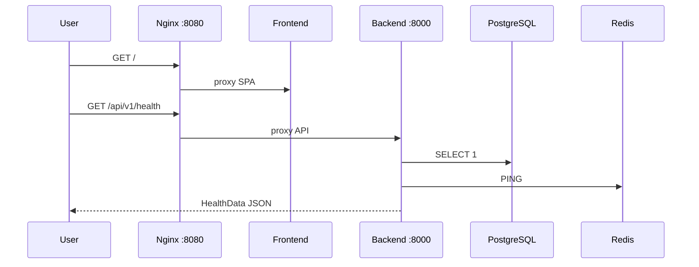

# Sprint 1 — Foundation

Tài liệu triển khai Sprint 1: khởi tạo monorepo, backend skeleton, frontend layout, Docker stack.

## Đã hoàn thành

- Backend FastAPI + SQLAlchemy models + Alembic migration `001`
- API skeleton: auth, users, employees, cameras, alerts, rules, dashboard, health
- Frontend layout: Login, Dashboard, Sidebar, Navbar, Loading, 404
- Docker: postgres, redis, backend, frontend, nginx

## Luồng khởi động

## Bước tiếp theo (Sprint 2)

- Auth JWT thật + seed admin user
- CRUD cameras/employees/rules
- Không bắt đầu AI/YOLO cho đến khi được chỉ định
