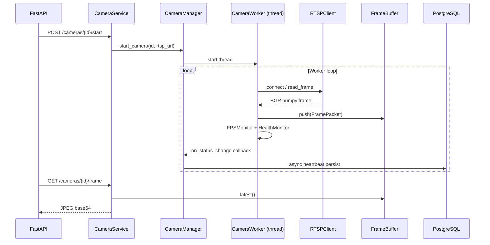
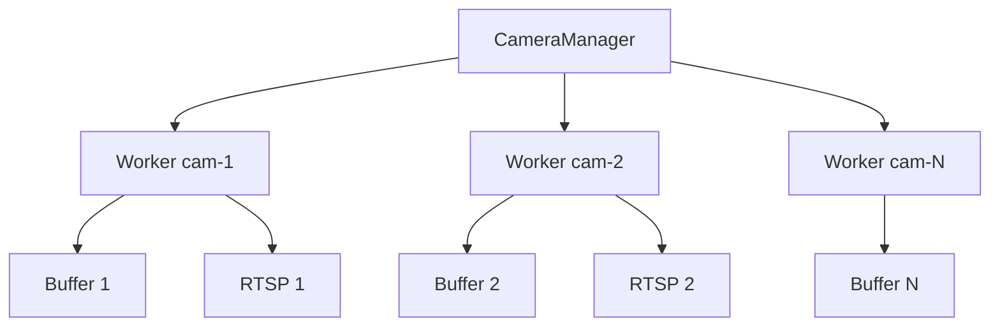
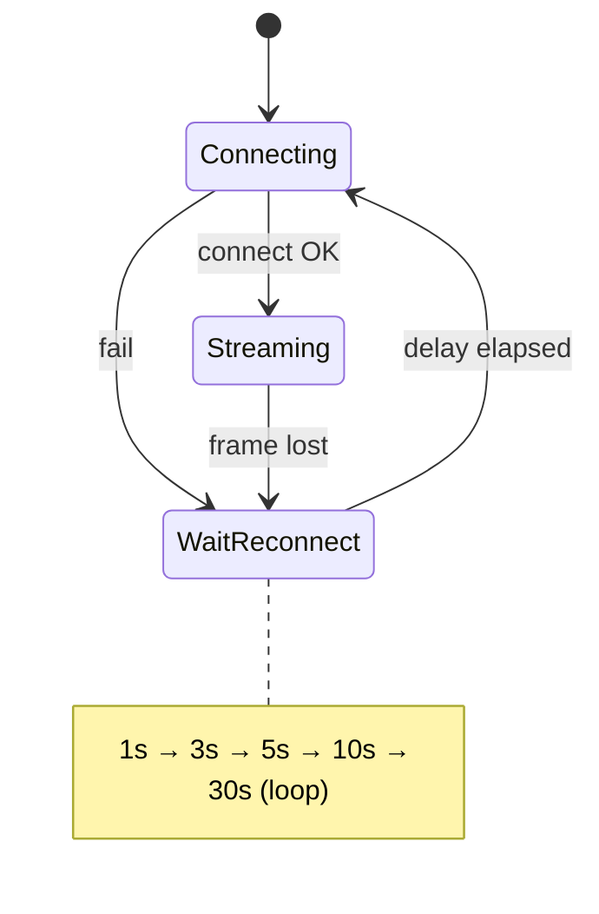

# 17 — Sprint 2: Camera Service

**Trạng thái:** Hoàn thành Sprint 2. Module độc lập — **không có AI/YOLO/Rule Engine**.

---

## 1. Mục tiêu đã đạt

| Yêu cầu | Trạng thái |
|---------|------------|
| Quản lý camera CRUD API | ✓ |
| Kết nối RTSP (OpenCV FFmpeg) | ✓ |
| Đọc frame liên tục | ✓ |
| FrameBuffer bounded queue | ✓ |
| Multi-camera (bulkhead) | ✓ |
| Auto Reconnect 1→3→5→10→30s | ✓ |
| FPS Monitor | ✓ |
| Health Monitor | ✓ |
| Unit Tests | ✓ |

---

## 2. Cấu trúc module

```
backend/app/modules/camera/
├── camera_manager/     # CameraManager — điều phối multi-cam
├── stream_reader/      # RTSPClient — OpenCV đọc stream
├── frame_buffer/       # FrameBuffer — queue thread-safe
├── stream_worker/      # FrameGrabber + CameraWorker
├── health_check/       # HealthMonitor
├── fps_monitor/        # FPSMonitor
├── reconnect/          # ReconnectPolicy
├── models/             # FramePacket, CameraRuntimeStatus
├── schemas/            # Pydantic API
├── services/           # CameraService
├── repositories/       # CameraRepository
├── utils/              # config_loader, frame_codec
├── exceptions/         # CameraException hierarchy
└── dependencies.py     # DI + lifecycle
```

---

## 3. Luồng hoạt động (Sequence)



---

## 4. Multi-camera (Bulkhead)



Một camera lỗi → worker reconnect độc lập, không crash process.

---

## 5. Auto Reconnect



---

## 6. Cấu hình `config/camera.yaml`

| Tham số | Mặc định | Ý nghĩa |
|---------|----------|---------|
| reconnect_delays | [1,3,5,10,30] | Backoff reconnect |
| queue_size | 30 | Max frame trong buffer |
| target_fps | 15 | FPS đọc mục tiêu |
| timeout_seconds | 10 | Timeout mở RTSP |
| auto_start_enabled | true | Auto-start camera enabled khi boot |

---

## 7. Database (migration 002)

Bổ sung cột `cameras`:
- `location`
- `last_online`
- `last_heartbeat`

Chạy migration:
```bash
docker compose exec backend alembic upgrade head
```

---

## 8. Test

```bash
cd backend
pytest tests/modules/camera -v
```

Coverage: FrameBuffer, ReconnectPolicy, RTSPClient (mock), HealthMonitor, CameraManager (mock).

---

## 9. Sprint 3 (chưa làm)

- AI / YOLO / ByteTrack
- Rule Engine
- Telegram
- Dashboard business logic

**Dừng tại đây — chờ xác nhận Sprint 3.**
