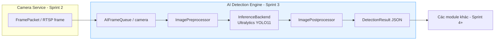
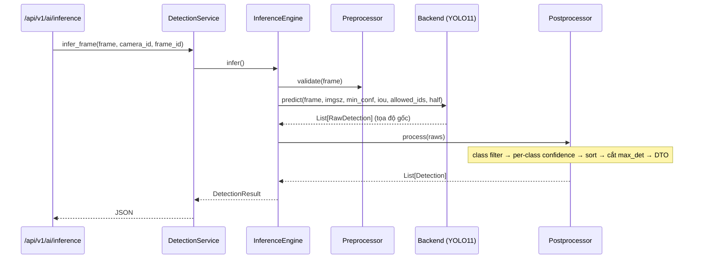
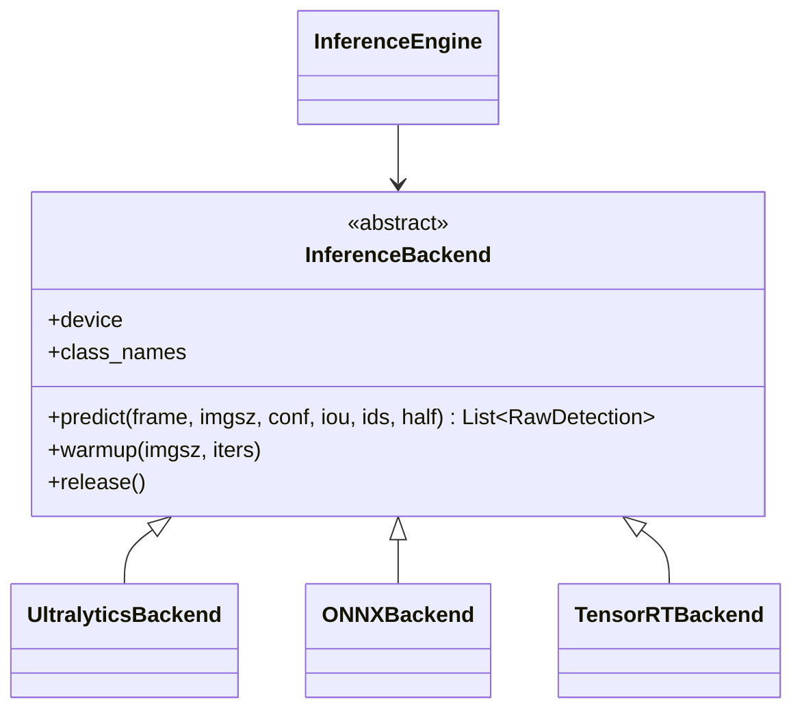
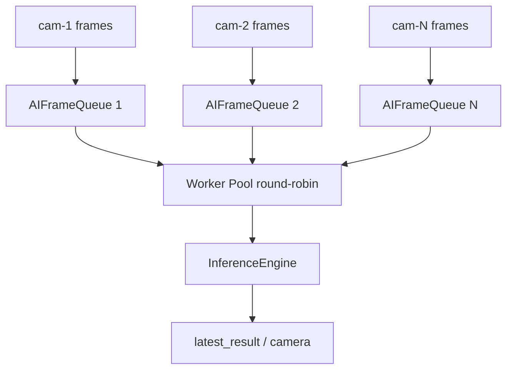

# 18 — Sprint 3: AI Detection Engine

**Trạng thái:** Hoàn thành Sprint 3. Module **độc lập** — chỉ Object Detection.
**KHÔNG** tracking, pose, rule engine, telegram, dashboard logic, performance score, database detection, alert.

---

## 1. Mục tiêu đã đạt

| Yêu cầu | Trạng thái |
|---------|------------|
| Load / verify / warmup / reload / release model | ✓ |
| InferenceEngine: frame → Detection list | ✓ |
| Preprocess: resize, normalize, convert color, padding, letterbox | ✓ |
| Postprocess: confidence filter, NMS, class filter, coordinate mapping | ✓ |
| DetectionResult DTO chuẩn (JSON) | ✓ |
| 10 class: person/phone/cup/bottle/food/laptop/keyboard/mouse/chair/monitor | ✓ |
| Confidence cấu hình theo từng class | ✓ |
| detection.yaml (model/device/imgsz/conf/nms/half/batch/max_det) | ✓ |
| Benchmark: FPS, inference time, CPU/GPU/VRAM/RAM | ✓ |
| Multi-camera: queue riêng, không block | ✓ |
| API: model/reload/inference/benchmark/statistics | ✓ |
| Visualization overlay (debug) | ✓ |
| Error handling: ModelNotFound/OOM/CUDA/InvalidFrame/Timeout | ✓ |
| Unit + Integration test | ✓ (39 test AI) |
| Sẵn sàng đổi ONNX/TensorRT không sửa business logic | ✓ (backend abstraction) |

---

## 2. Kiến trúc — Detection Engine độc lập



Engine **không biết** DB / tracking / telegram / rule engine. Chỉ nhận frame, trả JSON.

---

## 3. Luồng inference (Sequence)



**Vì sao vẫn cần Postprocessor khi Ultralytics tự NMS?**
Ultralytics chỉ nhận **một** ngưỡng confidence chung. Yêu cầu Sprint 3 là ngưỡng
**riêng theo class** (person 0.50, phone 0.65, food 0.55...). Engine chạy model ở
`min_confidence` rồi Postprocessor áp ngưỡng riêng + đổi nhãn logic + dựng DTO.

---

## 4. Backend abstraction (đổi ONNX/TensorRT không sửa logic)



Sprint 3 chỉ implement `UltralyticsBackend`. Thêm ONNX/TensorRT = thêm class mới,
`InferenceEngine`/`DetectionService`/API **không đổi** (Dependency Inversion + Open/Closed).

---

## 5. Multi-camera — queue riêng, không block



- Mỗi camera một `AIFrameQueue` bounded (drop-oldest → realtime).
- Worker pool lấy frame **round-robin fair** → camera nghẽn không chiếm hết.
- Queue đầy → drop frame cũ, **không block, không deadlock**.

---

## 6. DetectionResult — DTO chuẩn (JSON)

```json
{
  "camera_id": 1,
  "frame_id": 128,
  "timestamp": "2026-07-03T02:00:00+00:00",
  "objects": [
    {
      "class": "person",
      "class_id": 0,
      "confidence": 0.9123,
      "bbox": {"x1": 10, "y1": 20, "x2": 110, "y2": 260},
      "center": {"x": 60, "y": 140},
      "width": 100,
      "height": 240
    }
  ],
  "count": 1,
  "inference_time_ms": 22.5,
  "model_name": "yolo11n",
  "fps": 44.44,
  "width": 640,
  "height": 480
}
```

---

## 7. Class & COCO id mapping (config/detection.yaml)

| Nhãn logic | COCO id | Confidence mặc định |
|-----------|---------|---------------------|
| person | 0 | 0.50 |
| phone | 67 (cell phone) | 0.65 |
| cup | 41 | 0.50 |
| bottle | 39 | 0.50 |
| food | 46–55 (banana…cake) | 0.55 |
| laptop | 63 | 0.50 |
| keyboard | 66 | 0.50 |
| mouse | 64 | 0.50 |
| chair | 56 | 0.50 |
| monitor | 62 (tv) | 0.50 |

---

## 8. API (mount dưới /api/v1)

| Method | Path | Mô tả |
|--------|------|-------|
| GET | `/api/v1/ai/model` | ModelInfo |
| POST | `/api/v1/ai/reload` | Reload model |
| POST | `/api/v1/ai/inference` | Detect trên ảnh base64 (+ overlay debug nếu visualize=true) |
| POST | `/api/v1/ai/benchmark` | Benchmark FPS/thời gian/tài nguyên |
| GET | `/api/v1/ai/statistics` | Thống kê inference tích lũy |

---

## 9. Benchmark & mục tiêu hiệu năng

`BenchmarkService` chạy N inference trên ảnh ngẫu nhiên, đo:
FPS, inference time (avg/min/max), CPU%, RAM (MB), GPU%, VRAM (MB).

Mục tiêu (RTX 3060 — verify bằng `/api/v1/ai/benchmark` trong môi trường GPU thật):

| Model | FPS mục tiêu |
|-------|-------------|
| YOLO11n | ≥ 30 |
| YOLO11s | ≥ 20 |
| YOLO11m | ≥ 15 |

---

## 10. Error handling

| Exception | Khi nào |
|-----------|---------|
| ModelNotFoundError | Weight không tồn tại & không phải weight chuẩn |
| ModelLoadError | Thiếu ultralytics/torch, file hỏng |
| ModelNotLoadedError | Inference khi chưa load |
| GPUOutOfMemoryError | CUDA OOM |
| CUDAError | Lỗi CUDA/driver |
| InvalidFrameError | Frame None/sai shape |
| InferenceTimeoutError | Inference quá thời gian |

---

## 11. Test

```bash
cd backend
pytest tests/modules/ai -v      # 39 test AI
pytest -q                        # toàn bộ (61 test: Sprint 2 + 3)
```

Test dùng `FakeBackend` → chạy được **không cần torch/ultralytics/GPU**.
Integration test: `FramePacket` (Camera Service) → Detection → overlay + multi-camera isolation.

---

## 12. Ghi chú môi trường

- `torch`/`ultralytics` là dependency nặng, cài trong Docker (`requirements.txt`).
- App import an toàn khi thiếu chúng (lazy import); `auto_load` bọc try/except → không crash.
- GPU/FPS thực tế verify bằng endpoint `/benchmark` trên máy có RTX.

---

## 13. Sprint 4 (chưa làm)

- Tracking (ByteTrack), Pose Estimation
- Rule Engine, Telegram, Dashboard business, Performance Score

**Dừng tại đây — chờ Sprint 4.**
