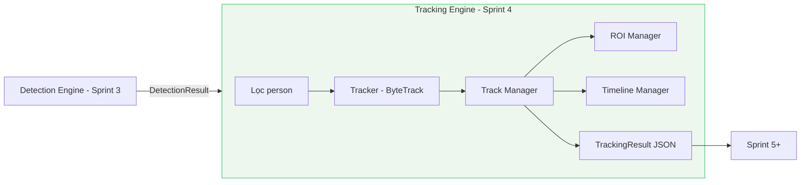
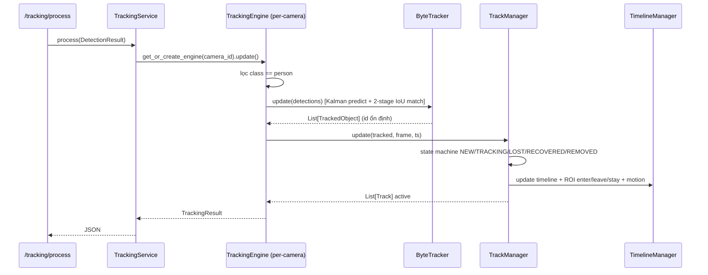
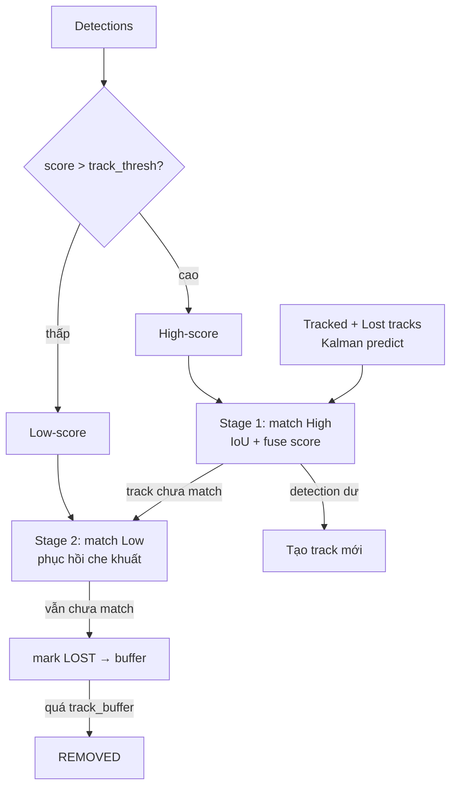
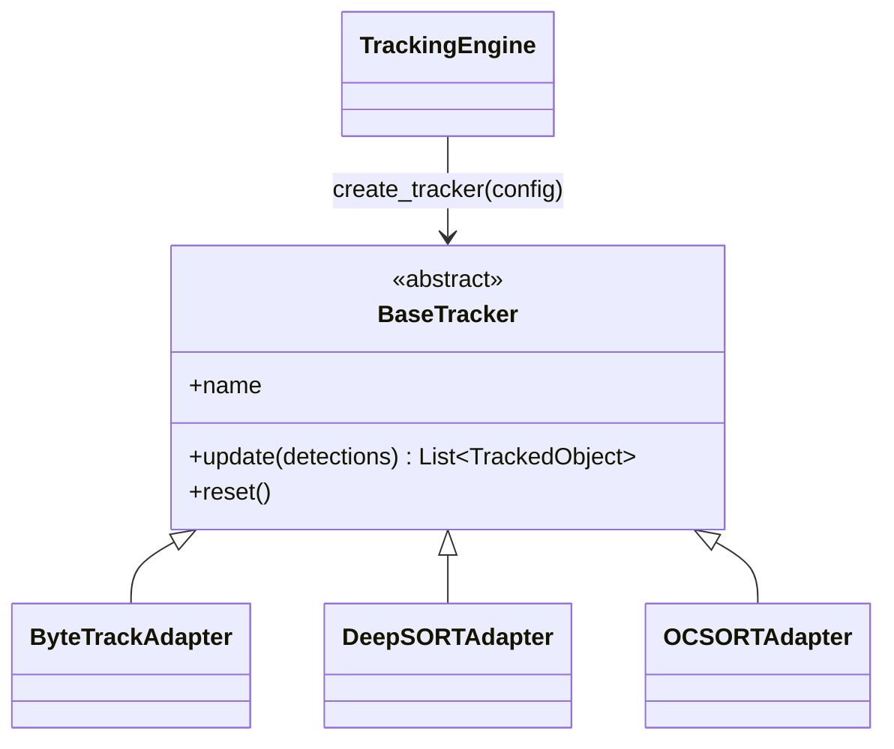
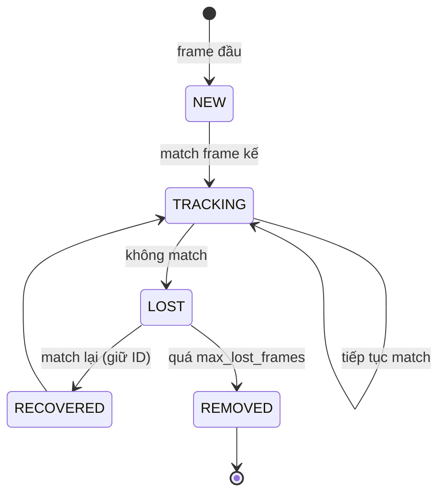
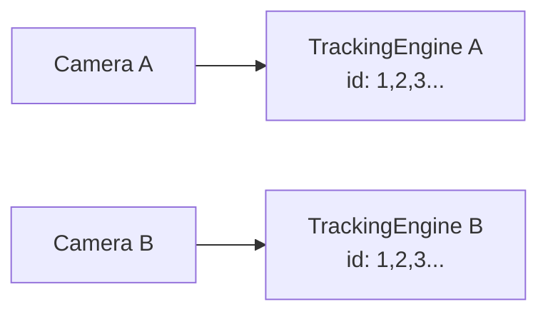

# 19 — Sprint 4: Object Tracking Engine

**Trạng thái:** Hoàn thành Sprint 4. Module **độc lập** — chỉ tracking người.
**KHÔNG** detect, YOLO, pose, face recognition, rule engine, telegram, dashboard, performance score, database, alert.

---

## 1. Mục tiêu đã đạt

| Yêu cầu | Trạng thái |
|---------|------------|
| Theo dõi từng người xuyên suốt video | ✓ |
| Gán Tracking ID ổn định (0 ID switch với 20 người test) | ✓ |
| Vòng đời track: NEW/TRACKING/LOST/RECOVERED/REMOVED | ✓ |
| ROI Manager (đa vùng, polygon) | ✓ |
| Timeline (first/last seen, duration, ROI history, movement) | ✓ |
| Thời gian xuất hiện + thời gian trong ROI | ✓ |
| Motion analysis: speed, direction, distance, path, stationary | ✓ |
| ROI analysis: enter/leave/stay/transition | ✓ |
| Multi-camera độc lập, KHÔNG chia sẻ track ID | ✓ |
| ByteTrack (đổi DeepSORT/OCSORT không đổi business logic) | ✓ |
| tracking.yaml (buffer/match/min area/lost timeout...) | ✓ |
| API tracking (live/camera/track/history/statistics/benchmark) | ✓ |
| Visualization overlay (id/bbox/roi/center/path/arrow/stay) | ✓ |
| Benchmark (FPS, track count, ID switch, stability, recovery, CPU/mem) | ✓ |
| Error handling (Lost/InvalidDetection/ROI/Overflow/Memory) | ✓ |
| Unit + Integration test | ✓ (48 test tracking) |

---

## 2. Kiến trúc — Tracking Engine độc lập



Tracking Engine **không đọc camera, không chạy model AI**. Chỉ nhận DetectionResult.

---

## 3. Luồng xử lý (Sequence)



---

## 4. ByteTrack — association 2 tầng



- **Kalman filter** (numpy thuần, không scipy) dự đoán vị trí track.
- **Hungarian** (numpy thuần) gán tối ưu track ↔ detection.
- **2-stage**: detection confidence thấp vẫn dùng để phục hồi track bị che → **ID ổn định**.
- **track_buffer**: giữ track LOST để lấy lại ID khi xuất hiện lại (recovery).

---

## 5. Abstraction — đổi thuật toán không đổi business logic



Thêm DeepSORT/OCSORT/StrongSORT = thêm adapter + 1 nhánh trong `create_tracker`.
`TrackManager`, `TrackingEngine`, `TrackingService`, API **không đổi**.

---

## 6. Vòng đời Track (State Machine)



---

## 7. TrackingResult — DTO chuẩn (JSON)

```json
{
  "camera_id": 1,
  "frame_id": 128,
  "timestamp": "2026-07-03T02:00:00+00:00",
  "tracks": [
    {
      "track_id": 12,
      "class": "person",
      "bbox": [10.0, 20.0, 50.0, 220.0],
      "center": [30.0, 120.0],
      "velocity": [2.0, -1.0],
      "speed": 0.02,
      "speed_px": 2.24,
      "direction": "LEFT",
      "roi": "Desk_03",
      "duration": 145.3,
      "status": "TRACKING",
      "score": 0.88
    }
  ],
  "count": 1,
  "processing_time_ms": 1.4
}
```

Endpoint chi tiết `/tracking/track/{id}` trả thêm `timeline` (first/last seen,
total_duration, roi_history với enter/leave/stay, movement_history, lost/recover count).

---

## 8. Multi-camera — ID độc lập



Mỗi camera một `TrackingEngine` + bộ đếm ID **riêng** (bắt đầu từ 1).
Camera A track 1 ≠ Camera B track 1 (không chia sẻ danh tính).

---

## 9. Config tracking.yaml

| Nhóm | Tham số |
|------|---------|
| tracker | type, track_thresh, new_track_thresh, low_thresh, match_thresh, track_buffer, min_box_area, frame_rate |
| lifecycle | max_lost_frames, max_tracks |
| motion | history_size, stationary_speed |
| roi | regions (global), cameras (override theo camera) |

---

## 10. API (mount /api/v1)

| Method | Path | Mô tả |
|--------|------|-------|
| POST | `/api/v1/tracking/process` | DetectionResult → TrackingResult |
| GET | `/api/v1/tracking/live` | Mọi camera |
| GET | `/api/v1/tracking/camera/{camera_id}` | 1 camera |
| GET | `/api/v1/tracking/track/{track_id}?camera_id=` | Chi tiết track |
| GET | `/api/v1/tracking/history?camera_id=` | Lịch sử |
| GET | `/api/v1/tracking/statistics` | Thống kê |
| POST | `/api/v1/tracking/benchmark` | Benchmark |

> Ghi chú: `/{cameraId}` và `/{trackId}` trong spec bị trùng đường dẫn, nên dùng
> tiền tố rõ ràng `/camera/{id}` và `/track/{id}` để tránh xung đột routing.

---

## 11. Benchmark

`BenchmarkService` sinh N người di chuyển qua M frame, đo:
FPS tracking, track count, **ID switch** (xấp xỉ = created − N), track stability,
recovery, lost, CPU, memory. Test xác nhận 20 người → ID switch ≤ 5, stability ≥ 0.7.

---

## 12. Error handling

| Exception | Khi nào |
|-----------|---------|
| TrackingLostError | Track mất ngoài phục hồi |
| InvalidDetectionError | DetectionResult None/không hợp lệ |
| ROIError | Polygon ROI < 3 đỉnh |
| TrackOverflowError | Vượt max_tracks |
| MemoryOverflowError | Tràn bộ nhớ tracking |

Track overflow được xử lý mềm (evict LOST cũ nhất + log) để không deadlock.

---

## 13. Test

```bash
cd backend
pytest tests/modules/tracking -v   # 48 test tracking
pytest -q                           # toàn bộ 109 test (Sprint 2+3+4)
```

Toàn bộ chạy **không cần torch/GPU** (tracking là CPU thuần numpy).

---

## 14. Sprint 5 (chưa làm)

Rule Engine, Telegram, Alert, Database, Pose Estimation, Dashboard business, Performance Score.

**Dừng tại đây — chờ Sprint 5.**
