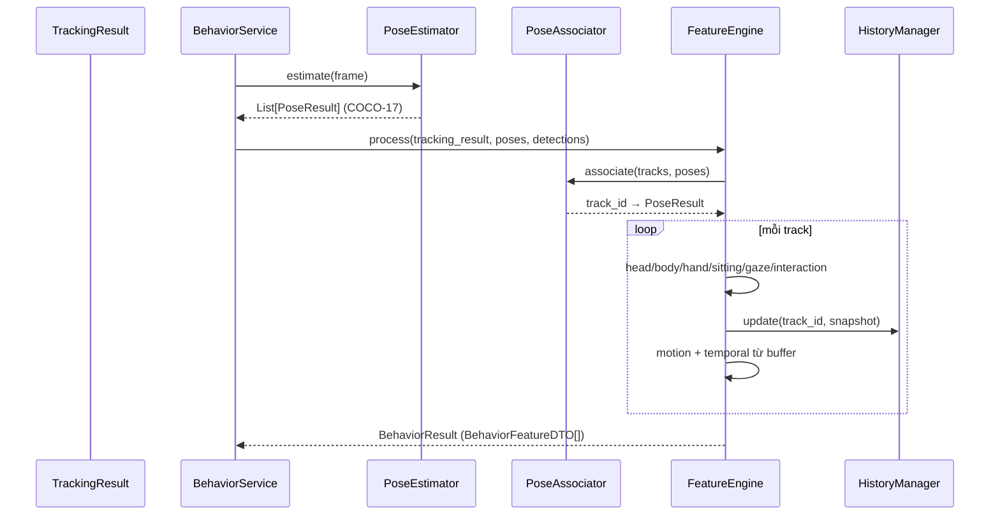

# Sprint 5 — Human Pose & Behavior Feature Extraction

## 1. Mục tiêu & phạm vi

Xây dựng **Human Behavior Feature Engine** trích xuất đặc trưng hành vi từ
`TrackingResult` (Sprint 4) để Rule Engine (Sprint 6) sử dụng.

**Không thuộc phạm vi (đã tuân thủ):** Action Recognition, Rule Engine, Alert,
Telegram, Dashboard, Database, Performance Score, Object Detection, Tracking.

```
Camera → Detection → Tracking → Behavior Feature Engine → BehaviorFeatureDTO → Sprint 6
```

## 2. Kiến trúc

Clean Architecture + SOLID. Các tầng:

- **Pose (Interface):** `PoseEstimator` (ABC) — `YOLOPoseEstimator` (YOLO11-pose,
  lazy import). Đổi model qua `pose/factory.py`, không ảnh hưởng business logic.
- **Extractors (thuần hình học, testable):** head, body, hand, sitting, motion, gaze.
- **Interaction:** phone / food / desk (dùng `ObjectContext` từ detections).
- **Associator:** ghép skeleton (pose) ↔ track theo IoU (track ID ổn định do Sprint 4).
- **Temporal:** `TemporalBuffer` (300 frame) + `HistoryManager` (LRU + prune).
- **Engine:** `BehaviorFeatureEngine` (per-camera) điều phối toàn bộ.
- **Service:** `BehaviorService` (facade đa camera, 1 pose model dùng chung) +
  `BenchmarkService`.
- **Repository:** `BehaviorRepository` in-memory (KHÔNG DB).

### Sequence



## 3. Đặc trưng (11 nhóm)

Head, Body, Hand, Sitting, Motion, Gaze, Temporal (300 frame), Phone Interaction,
Food, Face Orientation (= head direction), Desk Interaction. Xem bảng chi tiết
trong `backend/app/modules/behavior/README.md`.

> Head/Gaze/Face là ước lượng 2D — cung cấp tín hiệu, không kết luận tuyệt đối.

## 4. BehaviorFeatureDTO

```json
{
  "track_id": 15,
  "timestamp": "...",
  "head": {"direction": "DOWN", "angle": 28.0, "stability": 0.9, "available": true},
  "body": {"lean": "FORWARD", "angle": 5.0, "rotation": 3.0, "available": true},
  "hand": {"near_phone": true, "distance_phone": 12.0, "near_face": false, ...},
  "gaze": {"looking": "PHONE", "confidence": 0.6},
  "motion": {"stationary_time": 156.0, "movement_speed": 0.4, "direction": "STATIONARY"},
  "phone_feature": {"visible": true, "distance_hand": 12.0, "near": true, "duration": 3.5},
  "food_feature": {"hand_mouth": null, "near_mouth": false, ...},
  "chair_feature": {"sitting": true, "chair_detected": true, "hand_on_desk": true, ...},
  "temporal_feature": {"buffer_size": 300, "pose_history": 120, ...}
}
```

## 5. API

`POST /api/v1/behavior/process`, `GET /behavior/live`, `GET /behavior/{track_id}`,
`GET /behavior/camera/{id}`, `GET /behavior/statistics`, `POST /behavior/benchmark`.

## 6. Config — `config/behavior.yaml`

Pose model/device/threshold; associator IoU; ngưỡng feature; temporal buffer
size (300) / window / max_tracks; frame_rate. Mount `BEHAVIOR_CONFIG_PATH`.

## 7. Benchmark

`BenchmarkService` sinh dữ liệu tổng hợp (track + skeleton) đo: avg/p95 latency,
FPS, CPU %, Memory MB, GPU %, VRAM MB. Hỗ trợ `use_real_pose` khi có model.

## 8. Error handling & Logging

- Lỗi: `PoseError`, `PoseModelLoadError`, `InvalidSkeletonError`,
  `MissingJointError`, `BufferOverflowError`. Lỗi 1 track không làm hỏng frame
  (fallback DTO motion-only).
- Log: Pose Started/Finished, Feature Extracted, Temporal (prune) — qua Loguru.

## 9. Testing

`161 passed` toàn bộ (109 Sprint 2–4 + **52 Sprint 5**), không cần torch/GPU:

- Unit: pose/geometry, head, body, hand, sitting, motion, temporal buffer,
  history manager, associator, feature engine, DTO, benchmark.
- Integration: **Detection → Tracking (thật) → Behavior → BehaviorFeatureDTO**,
  live/track/statistics state, visualizer overlay.

```bash
cd backend && pytest tests/modules/behavior/ -q   # 52 passed
cd backend && pytest -q                            # 161 passed
```

## 10. Kiểm tra cuối Sprint

| Tiêu chí | Trạng thái |
|----------|-----------|
| Pose realtime (interface + benchmark) | ✅ |
| ≥ 20 người đồng thời | ✅ (test `handles_20_people`) |
| Đầy đủ Behavior Feature | ✅ |
| Temporal Buffer (300) | ✅ |
| Motion / Head / Hand / Body / Gaze Feature | ✅ |
| API | ✅ |
| Benchmark | ✅ |
| Unit + Integration Test Pass | ✅ (161) |
| KHÔNG Rule/Alert/Telegram/DB/Dashboard/Score | ✅ |

Dừng lại, chờ Sprint 6 (Rule Engine).
