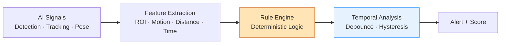

# AI Employee Monitoring System — Documentation

> **Release v1.0.0 — Production Ready** (2026-07-06)  
> Quick links: [Project Summary](reports/sprint12/Project-Summary.md) · [Release Notes](release-v1/Release-Notes.md) · [Installation](release-v1/Installation-Guide.md) · [QA Report](reports/sprint12/QA-Report.md)

---

# Design Documentation (Reference)

> Bộ tài liệu thiết kế ban đầu — hệ thống đã được triển khai đầy đủ qua 12 sprints.

## 1. Mục đích

Hệ thống **AI Employee Monitoring System (AEMS)** giám sát nhân viên văn phòng làm việc trên máy tính thông qua camera EZVIZ C6N (RTSP), kết hợp **Computer Vision + Rule Engine + Temporal Analysis** để **suy luận hành vi** thay vì nhận diện hành vi trực tiếp bằng Deep Learning, nhằm **giảm False Positive** và tăng độ chính xác.

## 2. Triết lý cốt lõi

- **KHÔNG** train model để đoán "lười", "nói chuyện riêng", "ngồi chơi".
- AI chỉ cung cấp **tín hiệu khách quan** (person, object, pose, id, vị trí).
- **Rule Engine** (logic tường minh, kiểm chứng được) mới đưa ra kết luận hành vi.
- **Temporal Analysis** khử nhiễu theo thời gian (debounce, hysteresis, sliding window).

## 3. Danh mục tài liệu

| # | Tài liệu | Mô tả | File |
|---|----------|-------|------|
| 01 | Software Requirement Specification | Yêu cầu chức năng & phi chức năng | [01-SRS.md](./01-SRS.md) |
| 02 | Technical Design Document | Thiết kế kỹ thuật tổng thể | [02-TDD.md](./02-TDD.md) |
| 03 | System Architecture | Kiến trúc hệ thống, component, luồng dữ liệu | [03-System-Architecture.md](./03-System-Architecture.md) |
| 04 | AI Architecture | Pipeline AI, model, tối ưu GPU | [04-AI-Architecture.md](./04-AI-Architecture.md) |
| 05 | Rule Engine Design | Thiết kế Rule Engine & 7 hành vi | [05-Rule-Engine-Design.md](./05-Rule-Engine-Design.md) |
| 06 | Database Design | ERD, schema, index, retention | [06-Database-Design.md](./06-Database-Design.md) |
| 07 | API Design | REST + WebSocket, hợp đồng API | [07-API-Design.md](./07-API-Design.md) |
| 08 | Folder Structure | Cấu trúc thư mục monorepo | [08-Folder-Structure.md](./08-Folder-Structure.md) |
| 09 | Deployment Architecture | Docker, Nginx, GPU, vận hành | [09-Deployment-Architecture.md](./09-Deployment-Architecture.md) |
| 10 | Roadmap | Lộ trình theo phase | [10-Roadmap.md](./10-Roadmap.md) |
| 11 | Task Breakdown | WBS, epic, story, estimate | [11-Task-Breakdown.md](./11-Task-Breakdown.md) |
| 12 | Test Plan | Chiến lược test toàn diện | [12-Test-Plan.md](./12-Test-Plan.md) |
| 13 | Risk Analysis | Rủi ro & giảm thiểu | [13-Risk-Analysis.md](./13-Risk-Analysis.md) |
| 14 | Security Analysis | Bảo mật & tuân thủ pháp lý | [14-Security-Analysis.md](./14-Security-Analysis.md) |
| 15 | Performance Analysis | Hiệu năng, benchmark, tối ưu | [15-Performance-Analysis.md](./15-Performance-Analysis.md) |

## 4. Tech Stack tóm tắt

| Lớp | Công nghệ |
|-----|-----------|
| AI / CV | Python 3.12, PyTorch, Ultralytics YOLO, ByteTrack, YOLO-Pose, OpenCV, TensorRT |
| Backend | FastAPI, SQLAlchemy 2.x, Pydantic v2, Celery/asyncio workers |
| Realtime | Redis (Streams + Pub/Sub), WebSocket |
| Frontend | React 18 + Vite, TypeScript, TailwindCSS, React Query, Zustand |
| Database | PostgreSQL 16 (+ TimescaleDB tùy chọn) |
| Storage | Local FS / MinIO (S3-compatible) cho snapshot & video evidence |
| Notify | Telegram Bot API |
| Infra | Docker, Docker Compose, Nginx, NVIDIA Container Toolkit |
| OS | Windows 11 + GPU NVIDIA RTX |

## 5. Quy ước đọc tài liệu

- Sơ đồ dùng **Mermaid** (render trực tiếp trên GitHub/Cursor).
- Mỗi hành vi có: input signals → điều kiện → tham số ngưỡng → temporal logic → output.
- Ngưỡng (threshold) được đặt trong **file cấu hình YAML**, không hard-code.

---
*Kết thúc giai đoạn thiết kế → chờ xác nhận trước khi triển khai code.*
